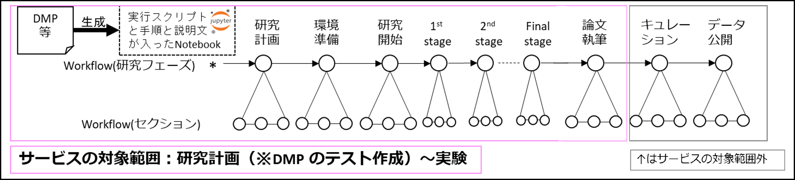

## 本チュートリアルについて

本チュートリアルでは[作成者の過去の研究](https://link.aps.org/doi/10.1103/PhysRevLett.123.123201)に類似する研究を想定し、データガバナンス機能の実証実験版サービス（本サービス）を利用する研究データ管理（RDM）を体験していただきます。例えば以下を体験していただきます。

* リサーチフローにより整備された研究手順を踏むことで、実験ごとに研究データを Gakunin RDMのプロジェクト上で管理できる。
* リサーチフローにより整備された実験手順を踏むことで、計算環境と独立した研究用プロジェクトへのデータ同期が容易に行える。
* モニタリング機能を利用して研究データのメタデータの状態を検証できる。
* これらの一連の操作において、ユーザーの能動的な動作は最初の実験の実施を除けばごく一部であり、大部分が自動的に行われる。

### 本チュートリアルの想定ユーザー

本チュートリアルの想定ユーザーを以下に示します。

* RDM 初級研究者。RDM を初めて実践する、または RDM に慣れていない研究者です。
* RDM 中級以上の研究者。RDM を自分なりのやり方で実践できる研究者です。

本チュートリアルの内容はどちらかというと RDM 初級経験者向けですが、リサーチフローのコンセプトは RDM 中級以上の研究者にも役立つと考えております。

### 本チュートリアルの目的

前述のような体験を通して、本チュートリアルでは、本サービスがユーザーの RDM 実践上の課題を解決する、またはその取っ掛かりになるアイデアをつかんでいただくことを目的としております。例えば以下のような課題を解決することを目指しております。

* RDM 初級研究者に関して：**RDM および DG の方法の学習・実践を支援します**。
* RDM 中級以上の研究者に関して：**自分なりの RDM 方法を実践するための時間的・労力的コストを削減するような支援を提供します**。

DG 機能を利用することで得られるであろうと作成者が想定しているメリットについては、各手順にてご説明いたします。

### 想定される研究フローと本チュートリアルの対象箇所

本チュートリアルで想定している研究フローを上図および下のリストに示します。本チュートリアルの対象箇所については「（**対象**）」を付しています。

1. 先行研究を調査する。
1. 研究計画を立てる。
1. データ管理計画を立てる。（**対象**）
    1. 研究データの管理場所を決める。（**対象**）
    1. データ管理計画を作成する。（**対象**）
1. 研究を開始する。（**対象**）
1. 実験を実施する。ここでは数値計算を伴う実験であるとします。（**対象**）
    1. 実験計画を立てる。
    1. 実験で使用する実験施設（計算基盤）への利用申請を出す。
    1. 実験準備を行う。（**対象**）
    1. 数値計算を実施する。（**対象**）
    1. 計算結果を整理する。（**対象**）
1. 解析を実施する。（**対象**）
    1. 解析計画を立てる。
    1. 実験結果の加工（前処理）・解析準備を行う。（**対象**）
    1. 実験結果を加工（前処理）・解析する。（**対象**）
    1. 解析手順を整理する。（**対象**）
    1. 解析結果を整理する。（**対象**）
    1. モデルを立てて数値計算を実施する。（**対象**）
    1. 先行研究の結果を参照しつつ実験結果および解析結果を解釈する。
1. 解析を繰り返す。（**対象**）
    * 結果の解釈の支援は含みません。
1. 必要に応じて実験を行う。（**対象**）
1. 実験結果および解析結果の解釈を踏まえて共同研究者と議論する。
1. 必要に応じて再解析する。
1. 共同研究者との間で実験結果、解析結果およびそれらの解釈に合意が取れたら論文を執筆する。（**対象**）
    * 必要に応じて学会にてそれらの結果および解釈について発表する。
1. 査読に向けて論拠データ（論文に記述する内容の根拠となる研究データ）の整理および共有設定を行う。
1. 論文を投稿する。
1. 査読に対応する。
1. 論文がアクセプトされたら論文および論拠データの公開準備を行う。
    * 必要に応じて、公開が望ましい研究データの公開準備も行う。
1. 論文および論拠データを公開する。

それでは[「基本編」](../02_basic/top.md)からチュートリアルを始めます。

## 移動用リンク

* [各種説明](./top.md)
