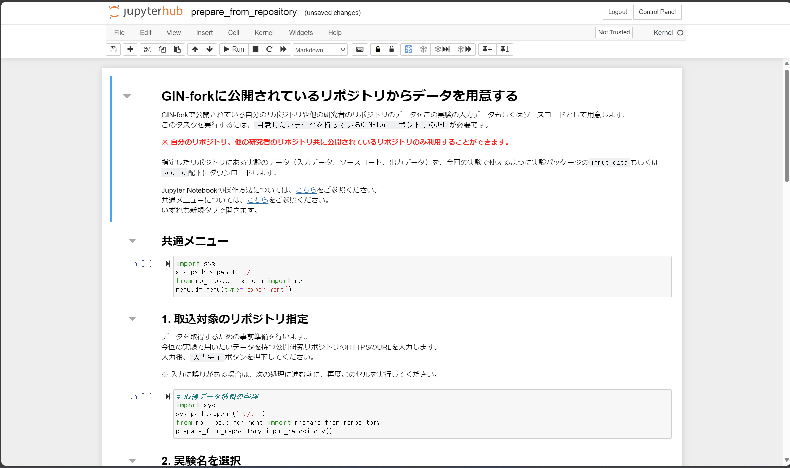
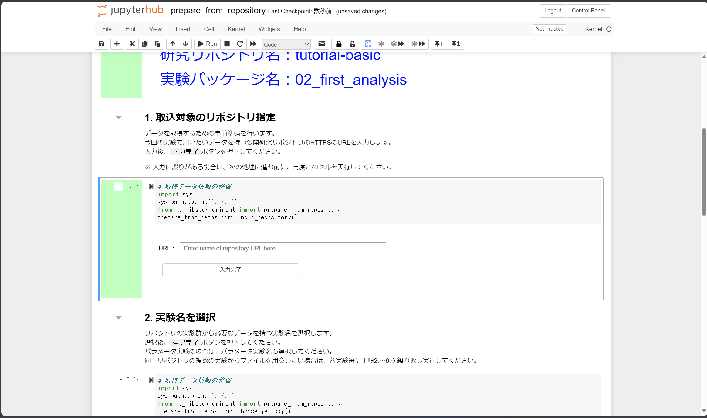
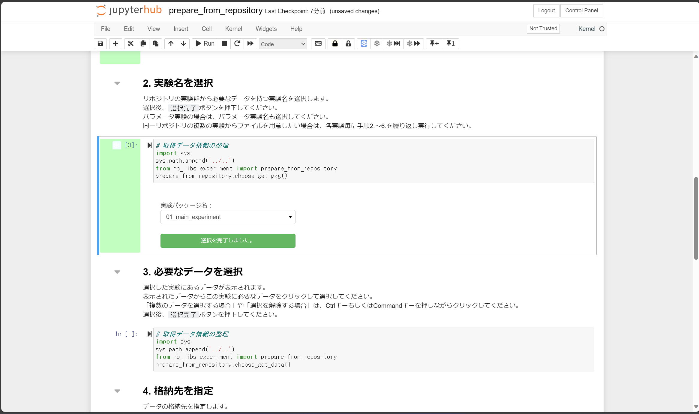
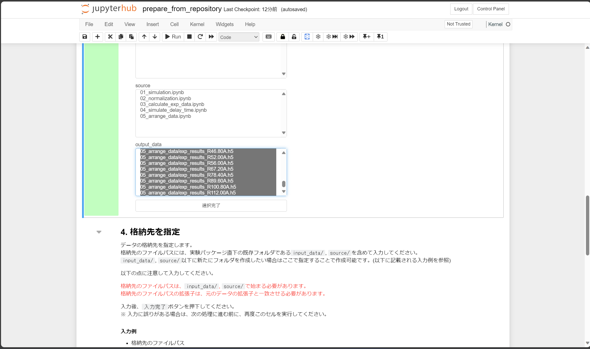

### 実験結果の解析を行う

本ステップでは、[本実験](./carry_out_main_experiment.md)で行った実験結果の最初の解析を実施します。
<!-- 本ステップでは以下を体験していただきます。 -->

<!-- * GIN-fork 公開リポジトリから解析用実験実行環境にデータをアップロードする。 -->

本ステップで実践する手順を以下に示します。

<!-- 1. [解析用の実験実行環境を構築する](#解析用の実験実行環境を構築する) -->
<!-- 1. [実験結果をインポートする](#実験結果をインポートする) -->
1. [解析ノートブックをアップロードする](#解析ノートブックをアップロードする)
1. [解析を実施する](#解析を実施する)
1. [解析結果を同期する](#解析結果を同期する)
1. [解析の説明を記述する](#解析の説明を記述する)

<!-- #### 解析用の実験実行環境を構築する

実験実行環境の構築手順は「テスト実験を行う」で実施した手順と同様です。以下を順に参照して実験実行環境の構築および初期セットアップを完了してください。

1. [テスト実験：実験実行環境を構築する](./carry_out_test_experiment.md#実験実行環境を構築する)
    * 今回は `first_analysis` をサブフロー名、`first_analysis_data` をデータディレクトリ名として設定します。
2. [テスト実験：実験パッケージの構成を用意する](./carry_out_test_experiment.md#実験パッケージの構成を用意する)
    * 今回は `First Analysis` を project_name 、`first_analysis` を project_slug として設定します。

実験実行環境の「実験パッケージの構成を用意」まで完了したら、実験サブフローメニューに遷移します。

#### 実験結果をインポートする

実験サブフローメニューにあるフロー中の「実験に利用するデータを用意する」をクリックし、データ準備用のノートブックに遷移します。今回は自身の研究用公開リポジトリからデータを取得しますので、「A：GIN-forkの公開リポジトリより取得」セクションのセルを実行します。すると「『GIN-forkに公開されているリポジトリからデータを用意する』の実行画面に遷移する」ボタンが出現します（下図参照）。


このボタンをクリックし、データ取得用ノートブック（下図）に遷移します。



「1. 取込対象のリポジトリ指定」セクション中のセルを実行します。出現するフォームに取込対象のリポジトリの URL を指定します（下図参照）。今回はご自身の本チュートリアル用のリポジトリの URL を入力してください。



URL 入力後、「入力完了」ボタンをクリックします。

「2. 実験名を選択」セクション中のセルを実行します。出現するフォームで実験パッケージ名（今回は`01_main_experiment`）を選択します。その後「入力完了」ボタンをクリックします。操作完了後は下図のようになります。



「3. 必要なデータを選択」セクション中のセルを実行します。出現するフォームで `output_data/05_arrange_data` ディレクトリ以下のデータを全て選択します（下図参照）。データを選択した状態で「選択完了」ボタンをクリックします。



「4. 格納先を指定」セクション中のセルを実行します。出現するフォームでデータのアップロード先を入力します。今回は`input_data/01_main_experiment` ディレクトリに全て格納するように値を入力します（下図参照）。


入力後、「入力完了」ボタンをクリックします。

「5. データの取り込み」セクション中のセルを実行します。これにより以下の処理が行われます。

1. リポジトリへの追加準備
2. データ取得履歴を記録
3. 取得データの実データをダウンロード
4. 不要なデータを削除
5. 実行結果の保存の準備

「6. GIN-forkに実行結果を同期」セクション中のセルを実行し、研究用リポジトリに一連の処理結果を同期します。最後に実験フロートップページに遷移します。
 -->
#### 解析ノートブックをアップロードする

まずは本実験（experiment_main）のサブフローメニューに遷移します。

この操作は[「本実験を行う」における「実験用データをアップロードする」](./carry_out_main_experiment.md#実験用データをアップロードする)セクションでの操作と同様です。今回は `source` ディレクトリに以下のノートブックをアップロードします。

* [06_determine_center_of_image.ipynb](../../../data/02_basic/02_first_analysis/source/06_determine_center_of_image.ipynb)
    * 実験結果に基づき画像中心を推定します。
<!-- ログメッセージとして以下を入力します。

```markdown
upload a notebook of the first analysis for a tutorial
``` -->

#### 解析を実施する

アップロードした 06_determine_center_of_image.ipynb を開き、上から順にセルを実行します。

#### 解析結果を同期する

この操作は[「テスト実験を行う」における「実験結果を研究用リポジトリに同期する」](./carry_out_test_experiment.md#実験結果を研究用リポジトリに同期する)セクションでの操作と同様です。
<!-- 前節の各ノートブック実行ごとに途中結果を同期するのが良いでしょう。今回は各ノートブックの実行後の途中結果の同期時に下表のようにログメッセージを入力します。

|ノートブック|ログメッセージ|
|:---|:---|
| `06_determine_center_of_image` | `execute a notebook which determines the center of image` | -->

#### 解析の説明を記述する

この操作は[「テスト実験を行う」における「実験の説明を記述する」](./carry_out_test_experiment.md#実験の説明を記述する)セクションでの操作と同様です。説明文の一例を「[README.md](../../../data/02_basic/02_first_analysis/docs/README.md) 」に示します。

<!-- #### 解析を終了し、解析用の実験実行環境を削除する

この操作は[「テスト実験を行う」における「実験を終了し、実験実行環境を削除する」](./carry_out_test_experiment.md#実験を終了し、実験実行環境を削除する)セクションでの操作と同様です。 -->

#### まとめ

本ステップでは、[「本実験を行う」](./carry_out_main_experiment.md)のステップで生成されたデータ解析する手順を試しました。

<!-- * GIN-fork 公開リポジトリから解析用実験実行環境にデータをアップロードする。 -->

本ステップを完了したら[次のステップに進みましょう](./carry_out_further_analyses.md)。
