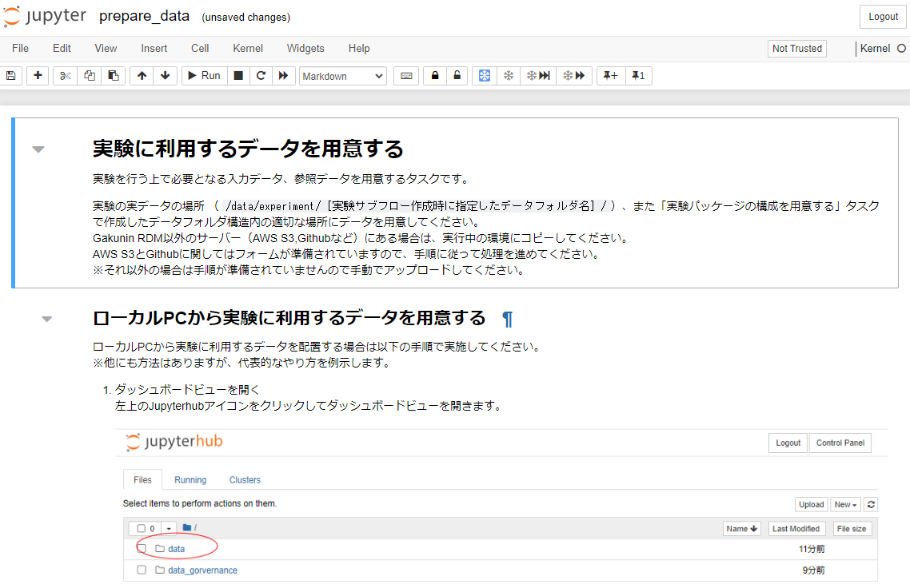
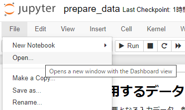

### 本実験を行う

本ステップでは、本チュートリアルが想定する研究テーマに沿って実験を行います。本ステップでは以下を体験していただきます。

* [「テスト実験を行う」](./carry_out_test_experiment.md)で学習した本サービスを利用する実験実行環境の構築～実験終了の操作を復習する。
* ローカル環境から実験実行環境へファイルをアップロードする。

本ステップで実践する手順を以下に示します。

- [本実験を行う](#本実験を行う)
  - [実験実行環境を構築する](#実験実行環境を構築する)
  - [実験用データをアップロードする](#実験用データをアップロードする)
  - [実験を実施する](#実験を実施する)
  - [実験結果を同期する](#実験結果を同期する)
  - [実験の説明を記述する](#実験の説明を記述する)
  - [まとめ](#まとめ)

#### 実験実行環境を構築する

実験実行環境の構築手順は「テスト実験を行う」で実施した手順と同様です。以下を順に参照して実験実行環境の構築および初期セットアップを完了してください。

1. [テスト実験：実験実行環境を構築する](./carry_out_test_experiment.md#実験実行環境を構築する)
    * 今回は `experiment_main` をサブフロー名、`experiment_main_data` をデータディレクトリ名として設定します。
1. [テスト実験：実験パッケージの構成を用意する](./carry_out_test_experiment.md#実験パッケージの構成を用意する)
    * 今回は `Experiment Main` を project_name 、`experiment_main` を project_slug として設定します。

実験実行環境の「実験パッケージの構成を用意」まで完了したら、実験サブフローメニューに遷移します。

#### 実験用データをアップロードする

実験サブフローメニューにあるフロー中の「実験に利用するデータを用意する」をクリックし、データ準備用のノートブック（下図）に遷移します。

|  |
|---|

今回はローカル環境からデータをアップロードしますので、「ローカルPCから実験に利用するデータを用意する」セクションの手順を実施します。

1. ダッシュボードビューを開く
    - ページ左上部の「File」をクリック後、「Open...」をクリックします。

        |  |
        |---|
      
2. アップロードする場所を開く
    - 左上部の→「data」→「experiment」→「experiment_main_data」→「experiment_main」の順序でクリックします。

3. 対応するディレクトリに移動し、右上の「Upload」をクリックし、以下のファイルをアップロードします。

    * `input_data` ディレクトリへアップロードするファイル：
        * [param.json](../../../data/02_basic/01_main_experiment/input_data/param.json)
        * [param_2.json](../../../data/02_basic/01_main_experiment/input_data/param_2.json)
    * `source` ディレクトリへアップロードするファイル：
        * [01_simulation.ipynb](../../../data/02_basic/01_main_experiment/source/01_simulation.ipynb)
        * [02_normalization.ipynb](../../../data/02_basic/01_main_experiment/source/02_normalization.ipynb)
        * [03_calculate_exp_data.ipynb](../../../data/02_basic/01_main_experiment/source/03_calculate_exp_data.ipynb)
        * [04_simulate_delay_time.ipynb](../../../data/02_basic/01_main_experiment/source/04_simulate_delay_time.ipynb)
        * [05_arrange_data.ipynb](../../../data/02_basic/01_main_experiment/source/05_arrange_data.ipynb)

「Gakunin RDMに保存する」を実行します。その後実験サブフローメニューに遷移します。

#### 実験を実施する

Jupyter Notebook を開き、前のセクションでアップロードしたファイルを以下の順に実行します。

1. `01_simulation.ipynb`
    * FCC 球状結晶の (111) 面からの Bragg スポットを計算します。
    * **このノートブック内のセルを全て実行するのに一時間弱かかります**。
1. `02_normalization.ipynb`
    * `01_simulation.ipynb` で計算された結晶のうち最大サイズのもの（定常状態相当）からの Bragg スポット強度を基準にして、各結晶からの Bragg スポット強度を規格化します。
1. `03_calculate_exp_data.ipynb`
    * 実験により近い結果になるように、疑似的にポアソンノイズおよび検出器ノイズを規格化された Bragg スポットに付加します。
1. `04_simulate_delay_time.ipynb`
    * NIR 照射後の遅延時間を疑似的に計算します。
1. `05_arrange_data.ipynb`
    * 各結晶について、上記 4 つの計算結果を一つの HDF5 ファイルにまとめます。

#### 実験結果を同期する

この操作は[「テスト実験を行う」における「実験結果をプロジェクトに同期する」](./carry_out_test_experiment.md#実験結果をプロジェクトに同期する)セクションでの操作と同様です。前節の各ノートブック実行ごとに途中結果を同期するのが良いでしょう。
<!--今回は各ノートブックの実行後の途中結果の同期時に下表のようにログメッセージを入力します。

|ノートブック|ログメッセージ|
|:---|:---|
| `01_simulation.ipynb` | `execute a notebook which simulates Bragg spots from nanocrystals` |
| `02_normalization.ipynb` | `execute a notebook which normalizes Bragg spot intensity` |
| `03_calculate_exp_data.ipynb` | `execute a notebook which adds noise to Bragg spot intensity` |
| `04_simulate_delay_time.ipynb` | `execute a notebook which simulates delay time of each nanocrystal` |
| `05_arrange_data.ipynb` | `execute a notebook which arranges the simulative results` |
-->

なお、同期するデータのサイズが大きいほど、または同期するデータの数が多いほど、同期にかかる時間が長くなります。

#### 実験の説明を記述する

この操作は[「テスト実験を行う」における「実験の説明を記述する」](./carry_out_test_experiment.md#実験の説明を記述する)セクションでの操作と同様です。説明文の一例を「[README.md](../../../data/02_basic/01_main_experiment/docs/README.md) 」に示します。

#### まとめ

本ステップでは以下を体験していただきつつ、[本章が扱う研究テーマ](./top.md#本章が扱う研究テーマ)に沿って X 銭広角散乱信号の模擬データを生成しました。

* [「テスト実験を行う」](./carry_out_test_experiment.md)で学習した本サービスを利用する実験実行環境の構築～実験終了の操作を復習する。
* ローカル環境から実験実行環境へファイルをアップロードする。この操作において、本サービスはアップロードされたデータを研究用リポジトリに同期して管理することを実現します。

本ステップを完了したら[次のステップに進みましょう](./carry_out_analysis.md)。
