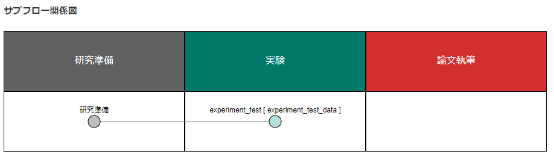
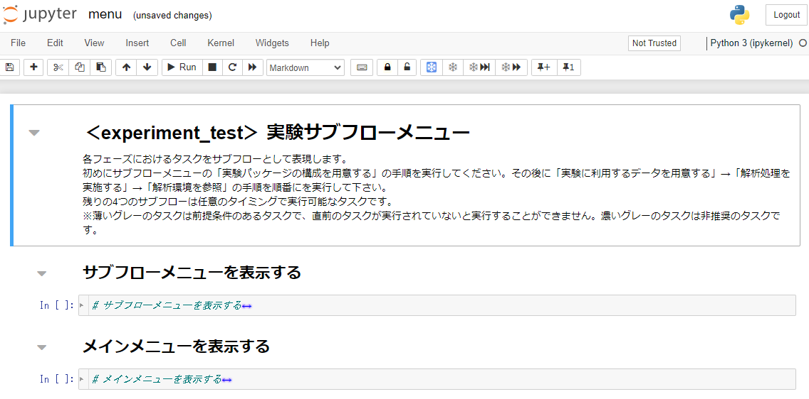
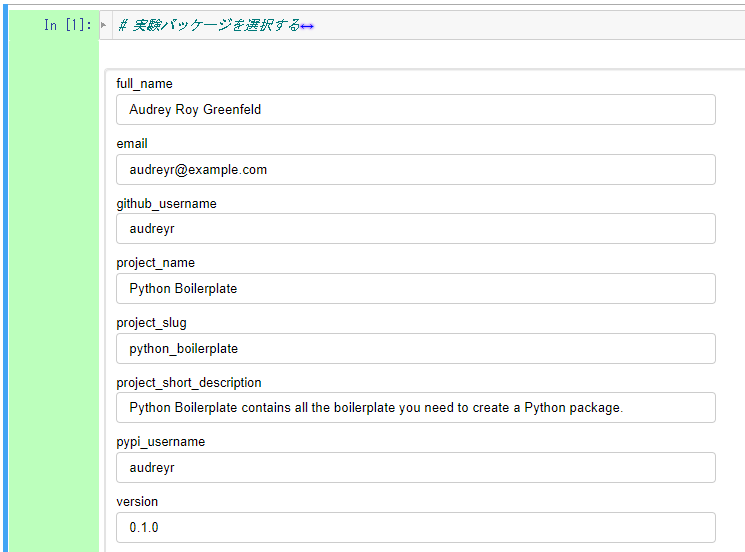
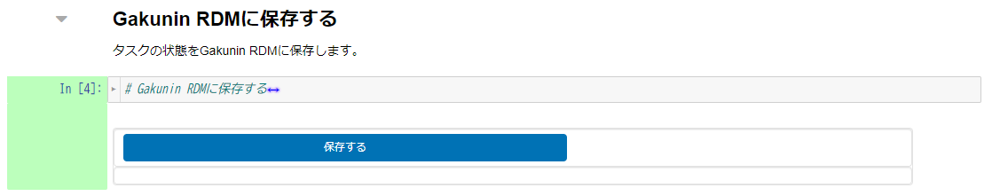
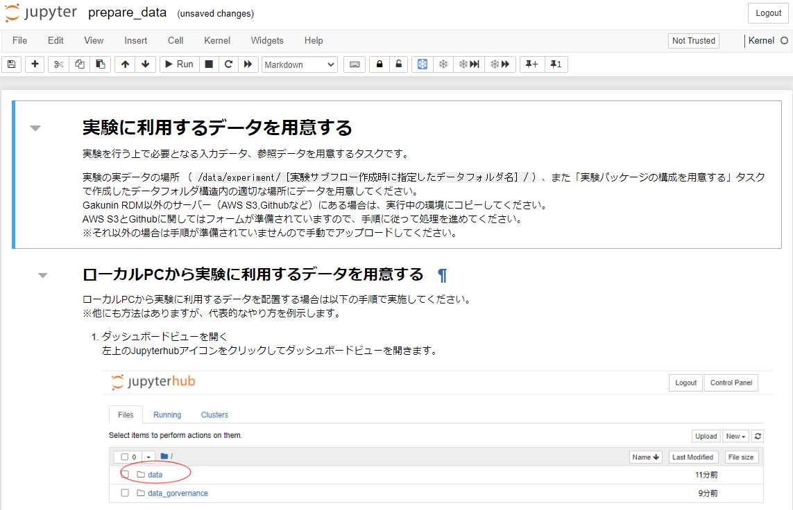
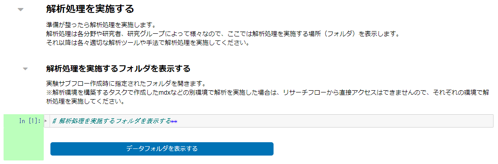
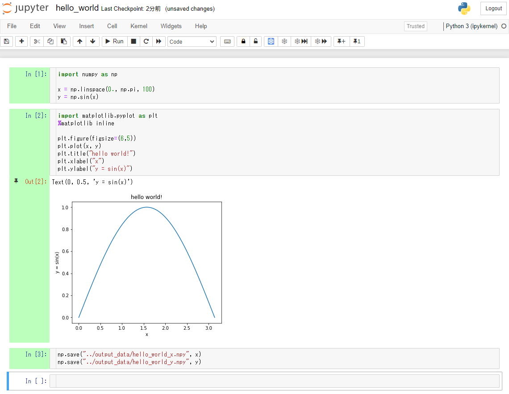

### テスト実験を行う

本ステップでは、本サービスにおける実験実行環境利用の「HelloWorld」としてテスト実験環境を構築し、NumPy を利用する簡単な計算を行います。本ステップで実践する手順を以下に示します。

- [テスト実験を行う](#テスト実験を行う)
  - [実験実行環境を構築する](#実験実行環境を構築する)
  - [実験パッケージの構成を用意する](#実験パッケージの構成を用意する)
  - [実験に利用するデータを用意する](#実験に利用するデータを用意する)
  - [実験の進め方を確認する](#実験の進め方を確認する)
  - [ノートブックを作成して計算を実行する](#ノートブックを作成して計算を実行する)
  - [実験結果をプロジェクトに同期する](#実験結果をプロジェクトに同期する)
  - [実験の説明を記述する](#実験の説明を記述する)
  - [まとめ](#まとめ)

#### 実験実行環境を構築する

「メインメニューを表示」のコードセルを実行し、メインメニューを表示します。

|  |
|---|

「サブフロー操作」下部のプルダウンから、「サブフロー新規作成」を選択します。

|  |
|---|

サブフローの詳細設定を行います。本チュートリアルでは以下のように入力します。

|項目名|値|
|:---|:---|
| サブフロー種別 | 実験（プルダウンから選択） |
| サブフロー名称 | experiment_test |
| データディレクトリ名 | experiment_test_data |
| 親サブフロー種別 | 研究準備（プルダウンから選択） |
| 親サブフロー選択 | （「研究準備」をクリック） |

設定項目をすべて入力後、「＋新規作成」をクリックします。

|  |
|---|

「サブフロー関係図」の「実験」にあるをクリックし、実験サブフローメニューに遷移します。

|  |
|---|

研究準備と同様に、背景が黄色となっているフロー図（下図）に従って操作を行います。

|  |
|---|

#### 実験パッケージの構成を用意する

「実験パッケージの構成を用意する」をクリックします。

|  |
|---|

「実験パッケージを選択する」のコードセルを実行します。

|  |
|---|

「研究分野」はプルダウンから「ライフサイエンス」を選択し、「推奨実験パッケージの利用有無」は「利用する（デフォルト）」とします。「確定」をクリックします。

処理が完了すると下図のように表示されます。

|  |
|---|

本チュートリアルでは各データを下表のように変更します。

|項目名|値|
|:---|:---|
| full_name | （ご自身の名前を英語で入力してください） |
| email | （ご自身のメールアドレスを入力してください） |
| github_username | （ご自身のGitHubのユーザー名を入力してください） |
| project_name | Experiment Test |
| project_slug | experiment_test |
| project_short_description | （本実験の概要を入力してください） |
| pypi_username | （PyPIのユーザー名を入力してください） |
| （以下の設定は変更の必要はありません） |

入力が完了したら「確定」をクリックします。「実験パッケージを/home/jovyan/data/experiment/experiment_test_dataに作成しました。」と表示されれば完了です。

本ステップで作成した実験パッケージはjupyterの以下のディレクトリに作成されます。

📁/data/experiment/experiment_test_data/experiment_test

|  |
|---|

実験パッケージの作成が完了後、「Gakunin RDMに保存する」のコードセルを実行します。

|  |
|---|

テキストボックスが表示された場合、パーソナルアクセストークンを入力し、「保存する」をクリックします。

「Gakunin RDMへの同期が完了しました。」と表示されるまで待機し、サブフローメニューへ戻ります。

|  |
|---|

サブフロー図の「実験パッケージの構成を用意する」に青いチェックマークが付いていることを確認します。

#### 実験に利用するデータを用意する

サブフロー図中の「実験に利用するデータを用意する」をクリックすると、本サービスを利用する実験に利用するデータを用意するページ（下図）にアクセスすることができます。

本ステップはテスト実験のためスキップします。サブフロートップページに戻りたい場合は、そのノートブックの最後のセルを実行することで現れる「サブフローメニューへアクセス」をクリックしてください。

|  |
|---|

#### 実験の進め方を確認する

サブフロー図中の「解析処理を実施する」をクリックします。

|  |
|---|

こちらのページでは、分析手法やツールの択などを確認することができます。必要に応じてご活用ください。

「解析処理を実施するフォルダを表示する」のコードセルを実行します。

|  |
|---|

表示された「データフォルダを表示する」をクリックします。

|  |
|---|

実験用ディレクトリにアクセスすることができます。
experiment_test ディレクトリに移動します。ここで、以下のディレクトリを作成します。
|項目|説明|
|:---|:---|
| input_data | 実験で利用する入力データを格納することが想定されているディレクトリです。 |
| output_data | 実験の結果として出力されるデータを格納することが想定されているディレクトリです。 |
| source | 実験のソースコードを格納することが想定されているディレクトリです。 |

ページ右上にある「New」プルダウンメニューを開きます。その中の「Folder」をクリックすると、新しく `Untitled Folder` という名前のフォルダが作成されます。フォルダを新しく3つ作成し、それぞれ上記の名前に変更します。

|  |
|---|

#### ノートブックを作成して計算を実行する

source ディレクトリに移動します。ページ右上にある「New」プルダウンメニューを開きます。その中の「Python3 (ipykernel)」をクリックすると、新しくノートブック `Untitled.ipynb` が作成され、別タブで開かれます（下図参照）。

|  |
|---|

このノートブックは通常の Jupyter Notebook のそれと同じように操作することが可能です。ノートブックページの左上にノートブックの名前が表示されています。その名前をクリックし、`hello_world` に変更します。

|  |
|---|

|  |
|---|

最初のセルで NumPy モジュールをインポートして正弦関数を計算してみましょう。以下のコードをセルに入力し、そのセルを実行します：

```python
import numpy as np

x = np.linspace(0., np.pi, 100)
y = np.sin(x)
```

続いて matplotlib を利用して先ほど計算した正弦関数をプロットします。別のセルを作成し、以下のコードをそのセルに入力し、実行します：

```python
import matplotlib.pyplot as plt
%matplotlib inline

plt.figure(figsize=(6,5))
plt.plot(x, y)
plt.title("hello world!")
plt.xlabel("x")
plt.ylabel("y = sin(x)")
```

もう一つ別のセルを作成します。そのセルの中で計算結果（`x` と `y`）を `output_data` ディレクトリ内に NumPy 形式で保存します：

```python
np.save("../output_data/hello_world_x.npy", x)
np.save("../output_data/hello_world_y.npy", y)
```

テスト実験は以上となります。上記手順通りにテスト実験を実施すると、`hello_world.ipynb` は下図のような状態になります。

|  |
|---|

#### 実験結果をプロジェクトに同期する

実験結果をGakunin RDMのプロジェクトに同期する場合、次の二つの方法があります。

* 実験を途中保存する。
* 実験終了時に保存する。

今回は頻繁に発生すると考えられる途中保存を実行します。

[実験の進め方を確認する](#実験の進め方を確認する)で遷移した「解析処理を実施する」のタスクに戻ります。

「Gakunin RDMに保存する」のコードセルを実行します。テキストボックスが表示された場合、パーソナルアクセストークンを入力し、「保存する」をクリックします。

|  |
|---|

「Gakunin RDMへの同期が完了しました。」が表示されたら同期成功です。

※同期完了まで10分～15分程度時間がかかります。

同期完了後、「サブフローメニューを表示する」のセルを実行し、サブフローメニューへ遷移します。

|  |
|---|

同様に、サブフローメニューのフロー図中の「解析結果を参照する」で同期することもできます。

|  |
|---|

「実験フォルダを開く」では、実験で使用したディレクトリを開くことができます。

<!-- 「再現性確認の準備」TODO -->

「Gakunin RDMに保存する」のコードセルを実行します。テキストボックスが表示された場合、パーソナルアクセストークンを入力し、「保存する」をクリックします。「Gakunin RDMへの同期が完了しました。」が表示されたら同期成功です。

#### 実験の説明を記述する

その実験がどのようなものであったかを実験後に理解できるようにするために、実験の説明を残しておくことが重要です。その説明が実験パッケージと一緒に保存されていれば、なお理解しやすくなるでしょう。もちろん、実験で用いた Jupyter notebook ファイルそのものに記述するのも良いでしょう。ここでは実験パッケージ内の `README.md` に実験の説明を残すという方法を採用します。

「実験フォルダを開く」から、実験用ディレクトリにアクセスし、 experiment_test ディレクトリに移動し、 `README.rst` をクリックして開きます。
ページ右上にある「New」プルダウンメニューを開きます。その中の「Text File」をクリックすると、新しくノートブック `untitled.txt` が作成され、別タブで開かれます。

|  |
|---|

開かれたノートブックのタイトルを`README.md`に変更します。

実験の説明の書き方は研究プロジェクトによって異なります。実際に本サービスを利用してご自身の研究を行う場合は、その研究プロジェクトの作法に沿って記述することが望ましいです。本チュートリアルでは、以下の方針に従って実験用の `README.md` を作成します。

* 見出し１に実験パッケージ名を入れる。
* 以下の構成で見出し２を入れる。
    * 実験概要
    * source
    * input_data
    * output_data
* 「実験概要」見出しに実験の概要を記述する。
* 「source」見出しに、`source` ディレクトリに含まれるソースコードをリストアップする。各ソースコードに説明を加える。
    * ソースコードがない場合は「ソースコードはありません。」を記述する。
* 「input_data」見出しに、`input_data` ディレクトリに含まれる入力データをリストアップする。各データに説明を加える。
    * データがない場合は「入力データはありません。」を記述する。
* 「output_data」見出しに、`output_data` ディレクトリに含まれる実験結果データをリストアップする。各データに説明を加える。
    * データがない場合は「出力データはありません。」を記述する。

このテスト実験では次のように説明文を作成してみます。既存の内容は全て削除し、上書きします。

```markdown
# hello_world

## 実験概要

この実験は「NII データガバナンス機能　実証実験版サービス用チュートリアル」の[「基本編：テスト実験を行う」](https://github.com/hirakinii/dg-alpha-service-tutorial/blob/main/docs/02_basic/get_started/carry_out_test_experiment.md)
に沿って行われました。

## source

* `hello_world.ipynb`
    * NumPy を用いて正弦関数を計算し、プロットします。

## input_data

入力データはありません。

## output_data

以下の実験結果が含まれております。

* `hello_world_x.npy`
    * 角度に対応する値が含まれています。
    * 値の単位はラジアンです。
    * `np.load` 関数を利用することで読み込むことが可能です。
* `hello_world_y.npy`
    * `hello_world_x.npy` に含まれる値を `np.sin` 関数に入力して計算された値が含まれています。
    * 値の単位はありません。
    * `np.load` 関数を利用することで読み込むことが可能です。

```

以上の文を入力した後、`README.md` 編集画面中のメニューバーから「File」→「Save」をクリックして更新内容を保存します。なお、Jupyter Notebook のキーボードショートカットを利用して更新内容を保存することも可能です。

更新内容の保存後、`README.md` 編集画面を閉じて「解析結果を参照する」ノートブックに移動します。そして「Gakunin RDMに保存する」セクションのセルを実行します。「Gakunin RDMへの同期が完了しました。」が表示されたら同期成功です。

#### まとめ

本ステップではリサーチフローを利用して、実験実行環境の構築、実験実施の手順を試しました。

本ステップを完了したら[次のステップに進みましょう](./carry_out_main_experiment.md)。
