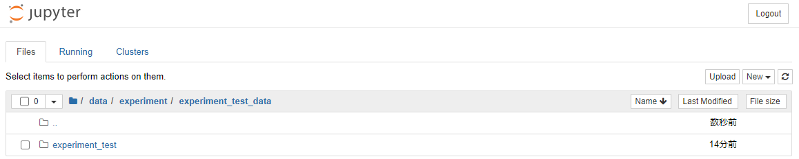
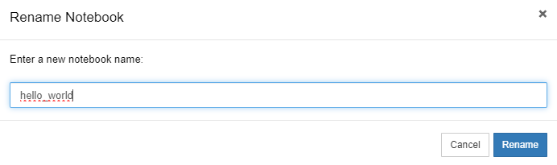

### テスト実験を行う

本ステップでは、本サービスにおける実験実行環境利用の「HelloWorld」としてテスト実験環境を構築し、NumPy を利用する簡単な計算を行います。本ステップで実践する手順を以下に示します。

1. [実験実行環境を構築する](#実験実行環境を構築する)
1. [実験パッケージの構成を用意する](#実験パッケージの構成を用意する)
2. [実験に利用するデータを用意する](#実験に利用するデータを用意する)
3. [実験の進め方を確認する](#実験の進め方を確認する)
4. [ノートブックを作成して計算を実行する](#ノートブックを作成して計算を実行する)
5. [実験結果を研究用リポジトリに同期する](#実験結果を研究用リポジトリに同期する)
6. [実験を終了し、実験実行環境を削除する](#実験を終了し、実験実行環境を削除する)
7. [実験を再開する](#実験を再開する)

#### 本ステップを実施する前に

**本チュートリアルに基づき実施されている研究内で稼働中の実験実行環境がある場合、それらの環境上での作業と衝突する可能性があります**。それを避けるため、それらの環境を全て研究用リポジトリに同期したうえで停止し、削除しておくことをお勧めします。

#### 実験実行環境を構築する

「メインメニューを表示」のコードセルを実行し、メインメニューを表示します。


「サブフロー操作」下部のプルダウンから、「サブフロー新規作成」を選択します。


サブフローの詳細設定を行います。本チュートリアルでは以下のように入力します。

|項目名|値|
|:---|:---|
| サブフロー種別 | 実験（プルダウンから選択） |
| サブフロー名称 | experiment_test |
| データディレクトリ名 | experiment_test_data |
| 親サブフロー種別 | 研究準備（プルダウンから選択） |
| 親サブフロー選択 | （「研究準備」をクリック） |

設定項目をすべて入力後、「＋新規作成」をクリックします。


「サブフロー関係図」の「実験」にあるをクリックし、実験サブフローメニューに遷移します。


研究準備と同様に、背景が黄色となっているフロー図（下図）に従って操作を行います。


#### 実験パッケージの構成を用意する

「実験パッケージの構成を用意する」をクリックします。


「1. 実験パッケージの選択」のコードセルを実行します。


「研究分野」はプルダウンから「ライフサイエンス」を選択し、「推奨実験パッケージの利用有無」は「利用する（デフォルト）」とします。「確定」をクリックします。

処理が完了すると下図のように表示されます。


本チュートリアルでは各データを下表のように変更します。

|項目名|値|
|:---|:---|
| full_name | （ご自身の名前を英語で入力してください） |
| email | （ご自身のメールアドレスを入力してください） |
| github_username | （ご自身のGitHubのユーザー名を入力してください） |
| project_name | Experiment Test |
| project_slug | experiment_test |
| project_short_description | （本実験の概要を入力してください） |
| pypi_username | （PyPIのユーザー名を入力してください） |
| （以下の設定は変更の必要はありません） |

入力が完了したら「確定」をクリックします。

処理が完了するまで待機し、「2. GRDMに実行結果を同期」のコードセルを実行します。


テキストボックスが表示された場合、パーソナルアクセストークンを入力し、「保存する」をクリックします。

「GRDMへの同期が完了しました。」と表示されるまで待機し、サブフローメニューへ戻ります。


サブフロー図の「実験パッケージの構成を用意する」に青いチェックマークが付いていることを確認します。


<!-- 研究フロートップページの研究フロー図中にある「実験を行う」をクリックします。それにより実験実行環境構築用ノートブック（下図）に遷移します。 -->

<!--  -->

<!-- 遷移先のノートブックにて上から順にセルを実行します。「1. 実験実行環境の作成」セクションの最後の実行結果に現れる「実験実行環境を作成」ボタンをクリックします（下図）。 -->

<!--  -->

<!-- それにより、コード付帯機能を利用する実験実行環境の構築が開始されます（下図）。実験実行環境の構築には 5 ~ 10 分程度かかる場合があります。 -->

<!--  -->

<!-- 環境構築後、自動的に実験フロートップページ（下図）に遷移します。このページでは実験実行環境における共通フローの他、実験フロー図を表示できます。 -->

<!--  -->

<!-- 実験中は主に実験フロー図（下図。「[(先行利用)データガバナンス機能の概要](https://support.rdm.nii.ac.jp/usermanual/58/)」より引用）を利用します。 -->

<!--  -->

<!-- #### 実験の初期セットアップを行う -->

<!-- 実験フロートップページにて上から順にセルを実行します。そうして現れた実験フロー図にある「初期セットアップを行う」をクリックし、初期セットアップ用ノートブック（下図）に遷移します。 -->

<!--  -->

<!-- 「共通メニュー」セクションのセルを実行すると、以下の項目を含むプルダウンメニューを利用できます。必要に応じてご利用ください。 -->

<!-- * 研究リポジトリ名・実験パッケージ名を確認する
    * 初期セットアップ実行前は実験パッケージ名が `-` となっております。
* 実験フロートップページに遷移する
* GIN-forkに遷移する -->

<!-- それでは初期セットアップを進めます。まずは「1. 事前準備」セクションのセルを実行します。そのセルを実行後、以下の情報が求められますので、それぞれ入力して「入力を完了する」ボタンをクリックしてください（下図参照）。 -->

<!-- |項目|値|
|:---|:---|
| GIN-fork ユーザー名 | ご自身の GIN-fork アカウント名 |
| パスワード | 上記アカウント名に対応するパスワード |
| 実験パッケージ名 | hello_world |
| テストコードフォルダ | 用意しない |
| CIツール用フォルダ | 用意しない | -->

<!--  -->

<!-- アカウント認証に成功すると、下図のようにボタンの表示が変わります。 -->

<!--  -->

<!-- 事前準備完了後、残りのセルを上から順に実行します。「4. 実験フロートップページへ」セクション中のセルを実行すると「実験フロートップページに遷移する」ボタンが現れます（下図）。 -->

<!--  -->

<!-- このボタンをクリックして実験フロートップページに遷移します。実験フロートップページにて「共通メニュー」セクションのセルを再実行し、プルダウンメニューから「研究リポジトリ名・実験パッケージ名を確認する」を選択すると、先ほど入力した実験パッケージ名（hello_world）が表示されます（下図）。また、実験フロー図を更新すると、実験フロー図中の「初期セットアップを行う」に「済」の印が付きます。 -->

<!--  -->

<!-- ※もしセルが凍結（freeze）されており実行できない場合は、解凍したいセルを選択後、ノートブックのツールバーにある「unfreeze selected cells」ボタンクリックしてください（下図参照）。 -->

<!--  -->

<!-- 実験の初期セットアップが完了した時点で、研究用リポジトリの「container list」中の「experiment container」グループに実験実行環境が追加されます。実験の途中で実験実行環境にアクセスしているページを閉じてしまっても、そのリストから対象環境にアクセスして実験を再開することが可能です。 -->

#### 実験に利用するデータを用意する

サブフロー図中の「実験に利用するデータを用意する」をクリックすると、本サービスを利用する実験に利用するデータを用意するページ（下図）にアクセスすることができます。本ステップはテスト実験のためスキップします。サブフロートップページに戻りたい場合は、そのノートブックの最後のセルを実行することで現れる「サブフローメニューへアクセス」をクリックしてください。


#### 実験の進め方を確認する

サブフロー図中の「解析処理を実施する」をクリックします。


こちらのページでは、分析手法やツールの択などを確認することができます。必要に応じてご活用ください。

「解析処理を実施するフォルダを表示する」のコードセルを実行します。


表示された「データフォルダを表示する」をクリックします。



実験用ディレクトリにアクセスすることができます。
experiment_test ディレクトリに移動します。ここで、以下のディレクトリを作成します。
|項目|説明|
|:---|:---|
| input_data | 実験で利用する入力データを格納することが想定されているディレクトリです。 |
| output_data | 実験の結果として出力されるデータを格納することが想定されているディレクトリです。 |
| source | 実験のソースコードを格納することが想定されているディレクトリです。 |

ページ右上にある「New」プルダウンメニューを開きます。その中の「Folder」をクリックすると、新しく `Untitled Folder` という名前のフォルダが作成されます。フォルダを新しく3つ作成し、それぞれ上記の名前に変更します。


<!-- 実験フロートップページの実験フロー図中の「実験の制約や進め方を確認する」をクリックすると、本サービスを利用する実験の制約や進め方を確認するページ（下図）にアクセスすることができます。必要に応じてご活用ください。なお、実験フロートップページに戻りたい場合は、そのノートブックの最後のセルを実行することで現れる「実験フロートップページに遷移する」ボタンをクリックしてください。

 -->

#### ノートブックを作成して計算を実行する

<!-- 実験フロートップページのメニューバーのうち「File」をクリックし、プルダウンメニューを表示します。プルダウンメニュー中の「Open...」をクリックし、別タブで開かれる Jupyter Notebook ページに遷移します（下図参照）。

 -->

<!-- このページにて、「root（フォルダマーク）」→「experiments」→「hello_world」の順にクリックして実験用ディレクトリに遷移します（下図参照）。 -->

<!--  -->

<!-- 実験用ディレクトリには以下のファイルおよびディレクトリが存在します。 -->

<!-- |項目|種類|説明|
|:---|:---|:---|
| input_data | ディレクトリ | 実験で利用する入力データを格納することが想定されているディレクトリです。 |
| output_data | ディレクトリ | 実験の結果として出力されるデータを格納することが想定されているディレクトリです。 |
| source | 実験のソースコードを格納することが想定されているディレクトリです。 |
| README.md | この実験パッケージ内で行われる実験や利用されるデータの説明等を記述するファイルです。 |
| Snakefile | モニタリング機能が再現性を検証する際に参照する実験手順を記述するファイルです。 | -->

source ディレクトリに移動します。ページ右上にある「New」プルダウンメニューを開きます。その中の「Python3 (ipykernel)」をクリックすると、新しくノートブック `Untitled.ipynb` が作成され、別タブで開かれます（下図参照）。


<!--  -->

このノートブックは通常の Jupyter Notebook のそれと同じように操作することが可能です。ノートブックページの左上にノートブックの名前が表示されています。その名前をクリックし、`hello_world` に変更します。




最初のセルで NumPy モジュールをインポートして正弦関数を計算してみましょう。以下のコードをセルに入力し、そのセルを実行します：

```python
import numpy as np

x = np.linspace(0., np.pi, 100)
y = np.sin(x)
```

続いて matplotlib を利用して先ほど計算した正弦関数をプロットします。別のセルを作成し、以下のコードをそのセルに入力し、実行します：

```python
import matplotlib.pyplot as plt
%matplotlib inline

plt.figure(figsize=(6,5))
plt.plot(x, y)
plt.title("hello world!")
plt.xlabel("x")
plt.ylabel("y = sin(x)")
```

もう一つ別のセルを作成します。そのセルの中で計算結果（`x` と `y`）を `output_data` ディレクトリ内に NumPy 形式で保存します：

```python
np.save("../output_data/hello_world_x.npy", x)
np.save("../output_data/hello_world_y.npy", y)
```

テスト実験は以上となります。上記手順通りにテスト実験を実施すると、`hello_world.ipynb` は下図のような状態になります。


<!--  -->

#### 実験結果を研究用リポジトリに同期する

実験結果を研究用リポジトリに同期する場合、次の二つの方法があります。

* 実験を途中保存する。
* 実験終了時に保存する。

今回は頻繁に発生すると考えられる途中保存を実行します。

サブフローメニューのフロー図中の「解析結果を参照する」をクリックします。


<!--  -->

<!-- 共通メニューは適宜ご利用ください。「1. 作業ログメッセージの入力」セクションのセルを実行すると、コミットメッセージの入力が求められます。今回は「hello world」と入力し、「入力完了」ボタンをクリックします（下図参照）。


続いて「2. 保存準備」セクションのセルを実行します。その後「3. GIN-forkに実行結果を同期」セクションのセルを実行します。下図のように「データ同期が完了しました。」が表示されたら同期成功です。


最後に「4. 実験フロートップページへ」セクションのセルを実行し、現れる「実験フロートップページに遷移する」ボタンをクリックして実験フロートップページに遷移します。

この時点で研究用リポジトリの `./experiments/hello_world` ディレクトリ内の `output_data` および `source` の中に先ほどのテスト実験で作成した以下のファイルが保存されていることを確認してみましょう。

* `output_data` 内
    * `hello_world_x.npy`
    * `hello_world_y.npy`
* `source` 内
    * `hello_world.ipynb` -->

「実験フォルダを開く」では、実験で使用したディレクトリを開くことができます。

<!-- 「再現性確認の準備」TODO -->

「2. Gakunin RDMに保存する」のコードセルを実行します。テキストボックスが表示された場合、パーソナルアクセストークンを入力し、「保存する」をクリックします。「GRDMへの同期が完了しました。」が表示されたら同期成功です。

#### 実験の説明を記述する

その実験がどのようなものであったかを実験後に理解できるようにするために、実験の説明を残しておくことが重要です。その説明が実験パッケージと一緒に保存されていれば、なお理解しやすくなるでしょう。もちろん、実験で用いた Jupyter notebook ファイルそのものに記述するのも良いでしょう。ここでは実験パッケージ内の `README.md` に実験の説明を残すという方法を採用します。

「実験フォルダを開く」から、実験用ディレクトリにアクセスし、 experiment_test ディレクトリに移動し、 `README.rst` をクリックして開きます。
ページ右上にある「New」プルダウンメニューを開きます。その中の「Text File」をクリックすると、新しくノートブック `untitled.txt` が作成され、別タブで開かれます。


開かれたノートブックのタイトルを`README.md`に変更します。

<!-- 実験フロートップページにある実験フロー図中の「実験の説明を記述する」をクリックし、説明記述用のノートブック（下図）に遷移します。


共通メニューは適宜ご利用ください。「1-1. 記述準備」セクションのセルを実行します。表示される「`README.md`編集画面に遷移する」ボタンをクリックし、編集画面に遷移します（下図）。

 -->

実験の説明の書き方は研究プロジェクトによって異なります。実際に本サービスを利用してご自身の研究を行う場合は、その研究プロジェクトの作法に沿って記述することが望ましいです。本チュートリアルでは、以下の方針に従って実験用の `README.md` を作成します。

* 見出し１に実験パッケージ名を入れる。
* 以下の構成で見出し２を入れる。
    * 実験概要
    * source
    * input_data
    * output_data
* 「実験概要」見出しに実験の概要を記述する。
* 「source」見出しに、`source` ディレクトリに含まれるソースコードをリストアップする。各ソースコードに説明を加える。
    * ソースコードがない場合は「ソースコードはありません。」を記述する。
* 「input_data」見出しに、`input_data` ディレクトリに含まれる入力データをリストアップする。各データに説明を加える。
    * データがない場合は「入力データはありません。」を記述する。
* 「output_data」見出しに、`output_data` ディレクトリに含まれる実験結果データをリストアップする。各データに説明を加える。
    * データがない場合は「出力データはありません。」を記述する。

このテスト実験では次のように説明文を作成してみます。既存の内容は全て削除し、上書きします。

```markdown
# hello_world

## 実験概要

この実験は「NII データガバナンス機能　機能評価試験版サービス用チュートリアル」の[「基本編：テスト実験を行う」](https://github.com/hirakinii/dg-alpha-service-tutorial/blob/main/docs/02_basic/get_started/carry_out_test_experiment.md)
に沿って行われました。

## source

* `hello_world.ipynb`
    * NumPy を用いて正弦関数を計算し、プロットします。

## input_data

入力データはありません。

## output_data

以下の実験結果が含まれております。

* `hello_world_x.npy`
    * 角度に対応する値が含まれています。
    * 値の単位はラジアンです。
    * `np.load` 関数を利用することで読み込むことが可能です。
* `hello_world_y.npy`
    * `hello_world_x.npy` に含まれる値を `np.sin` 関数に入力して計算された値が含まれています。
    * 値の単位はありません。
    * `np.load` 関数を利用することで読み込むことが可能です。

```

以上の文を入力した後、`README.md` 編集画面中のメニューバーから「File」→「Save」をクリックして更新内容を保存します。なお、Jupyter Notebook のキーボードショートカットを利用して更新内容を保存することも可能です。

更新内容の保存後、`README.md` 編集画面を閉じて「解析結果を参照する」ノートブックに移動します。そして「2. Gakunin RDMに保存する」セクションのセルを実行します。「GRDMへの同期が完了しました。」が表示されたら同期成功です。

<!-- 最後に「サブフローメニューへ」セクションのセルを実行し、現れる「サブフローメニューへアクセス」ボタンをクリックしてサブフローメニューに遷移します。 -->

<!-- #### 実験を終了し、実験実行環境を削除する

実験を終了するとき、再現性の確保や再実験を行う場合に備えて、その実験が行われた環境構成を保存しておくことが望ましいです。本サービスではそれらの操作がボタンクリックのみで完結します。

実験フロー図中の「実験を終了する」をクリックし、実験終了用ノートブック（下図）に遷移します。


このノートブック内でセルを上から順に実行します。「2-1. 当実行環境の確認」セクションのセルの実行後に、現在実験を行っている環境のタグが表示されます。JupyterHub のサーバー管理ページ（下図）に遷移し、そのタグに対応する環境を stop & delete します。これにて実験実行環境を削除できます。


※実験実行環境削除後、実験実行環境にはアクセスできなくなります。そのため実験フロー用ノートブックを開いているページにて下図のように「Dead kernel」ダイアログが表示される場合があります。この表示を無視して当該ノートブックを閉じていただいて問題ございません。

 -->

<!-- #### 実験を再開する

本ステップの最後に、実験を再開する手順を示します。研究用リポジトリの「container list」の「experiment container」グループにある「rebuild」ボタン（下図）をクリックし、実験実行環境用のコンテナを構築します。


そのコンテナの構築の完了後、自動的に再実験用のページ（下図）に遷移します。


共通メニューは適宜ご利用ください。「1. 事前準備」セクションのセルを実行します。出力されるフォームに以下の情報を入力して「入力を完了する」ボタンをクリックします（下図参照）。そのボタンの文字が「入力を受け付けました。次の手順へお進みください。」に変われば認証成功です。


「2. 初期セットアップ」セクションのセルを実行します。続いて「3. 実行結果をGIN-forkに同期」セクションのセルを実行します。「データ同期が完了しました。」が表示されたら同期成功です。

「4. 実験フロートップページへ」セクションのセルを実行し、現れるボタンをクリックして実験フロートップページに遷移します。遷移先である実験フロートップページの「共通メニュー」セクションのセルを実行し、現れるプルダウンメニューから「研究リポジトリ名・実験パッケージ名を確認する」を選択します。その結果として現れる実験パッケージ名が、ご自身が選択したものと同じであることを確認してください。

後はこれまでに示したような手順で再実験を行うことが可能です。 -->

#### まとめ

本ステップではリサーチフローを利用して、実験実行環境の構築、実験実施の手順を試しました。

本ステップを完了したら[次のステップに進みましょう](./carry_out_main_experiment.md)。
