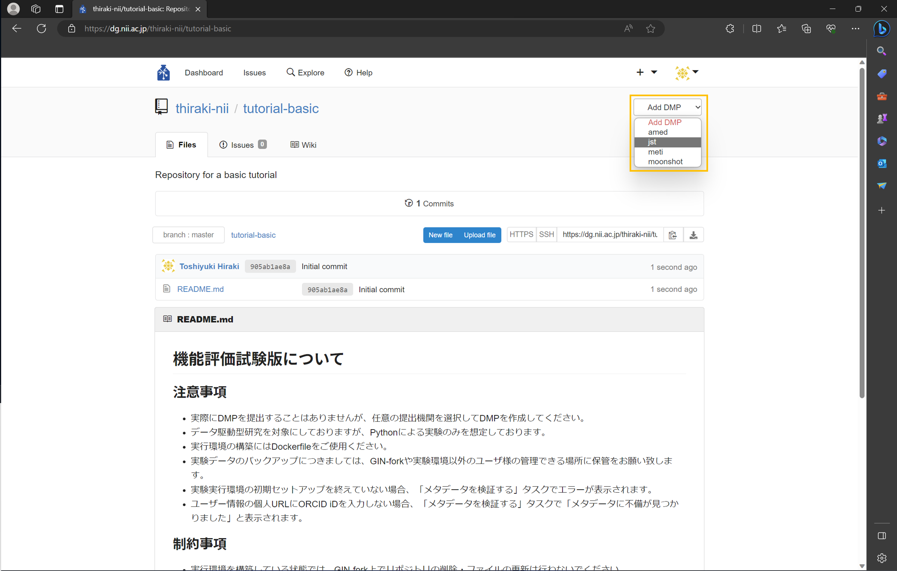
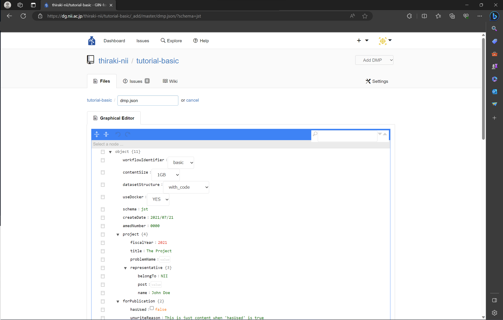
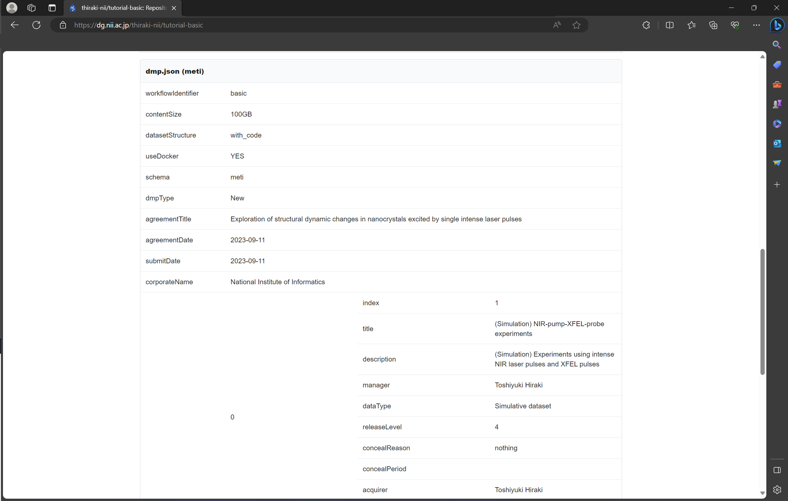

### データ管理計画を作成する

[前のステップ](./create_repository.md)では、本チュートリアルに必要な研究用リポジトリを作成しました。このステップでは、そのリポジトリで扱う研究用のデータ管理計画（DMP）を作成します。本ステップで実践する手順を以下に示します。

1. [DMPを選択する](#DMPを選択する)
1. [DMPの内容を入力する](#DMPの内容を入力する)

#### 本ステップで体験していただくこと

* **機械可読性（machine actionability）をより強く意識した形で DMP を作成する**。具体的には、JSON 形式で DMP を作成します（`dmp.json`）。
* **研究用リポジトリ内で管理・利活用される形で DMP を作成する**。

#### 本サービスで作成する DMP に関する留意事項

* 本サービスで作成される DMP はあくまで試験的なものです。
* 本サービスの DMP 作成機能はテスト機能です。この DMP を助成機関に提出することはできません。
* 2023/8/30 時点では、作成された DMP を後から変更しても研究実行環境および実験実行環境に反映されない点に注意してください。
* **本サービスにおいて、研究開始時に作成された DMP を後から変更しないようにしてください**。

#### DMPを選択する

リポジトリのトップページ右上にある「Add DMP」プルダウンメニューを開きます。今回は `meti` を選択します。

DMP を選択すると DMP 入力ページに遷移します。

#### DMPの内容を入力する

DMP 入力ページにて DMP の値を入力します。本チュートリアルでは下表のように入力します。それぞれの項目の説明は[本サービスのマニュアルの「2. 研究を開始する」](https://support.rdm.nii.ac.jp/usermanual/60/#start_er)にある「■GIN-forkで入力するDMPの項目について」をご参照ください。

|項目名|値|
|:---|:---|
|workflowIdentifier | basic |
|contentSize | 100GB |
| datasetStructure | with_code |
| useDocker | YES |
| schema | meti |
| dmpType | New |
| agreementTitle | Exploration of structural dynamic changes in nanocrystals excited by single intense laser pulses |
| agreementDate | 2023-09-11 |
| submitDate | 2023-09-11 |
| corporateName | National Institute of Informatics |
| **researches 0** ||
| index | 1|
| title | (Simulation) NIR-pump-XFEL-probe experiments |
| description | (Simulation) Experiments using intense NIR laser pulses and XFEL pulses|
| manager| （ご自身の名前を入力してください。） |
|dataType | Simulative dataset |
| releaseLevel | 4|
| concealReason | nothing |
| concealPeriod | （入力の必要はありません。）|
| acquirer | （ご自身の名前を入力してください。）|
| acquireMethod	| by download link |
| remarks | （入力の必要はありません。）|
| **researches 1** ||
| index | 2|
| title | Analysis of the experimental results |
| description | Analysis of the (simulative) experimental results to explore the process of structural changes |
| manager| （ご自身の名前を入力してください。） |
|dataType | Dataset |
| releaseLevel | 4 |
| concealReason | nothing |
| concealPeriod | （入力の必要はありません。）|
| acquirer | （ご自身の名前を入力してください。）|
| acquireMethod	| by download link |
| remarks | （入力の必要はありません。）|

全ての情報を入力した後、ページ下部にある「Commit Changes」ボタンをクリックします。これにより DMP が生成されたことを研究用リポジトリに commit します。その結果、研究用リポジトリ内に `dmp.json` が生成されます。

`dmp.json` が生成されると、研究用リポジトリのトップページに DMP の内容が表示されます（下図）。

#### まとめ

本ステップではデータ管理計画（DMP）を試験的に作成する方法を試しました。試験的な機能ではあるものの、機械可読性（machine actionability）をより強く意識した形での DMP の作成を体験いただきました。

本ステップを完了したら[次のステップに進みましょう](./create_madmp.md)。
