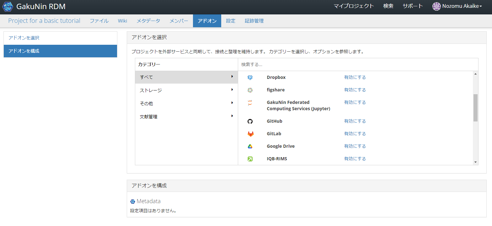
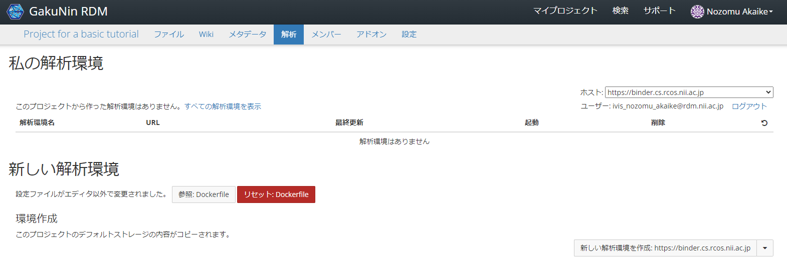
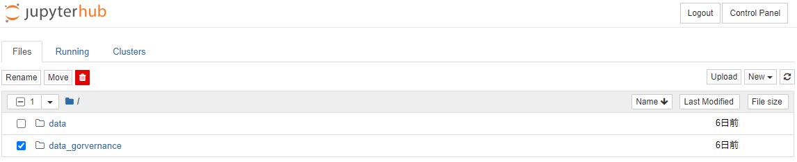
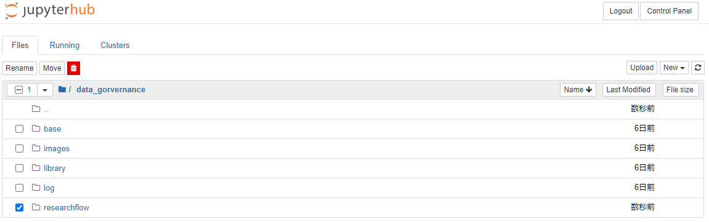

### データ管理計画を作成する

[前のステップ](./create_project.md)では、本チュートリアルに必要な研究用プロジェクトを作成しました。本ステップでは、そのプロジェクトで扱う研究用のデータ管理計画（DMP）を作成します。本チュートリアルでは、ガバナンスシートを DMP として扱います。ガバナンスシートとは、研究データの管理において守られるべきルールを設定するシートです。適用したいルールを一覧からチェックリスト形式で選択するだけで作成することができます。本ステップで実践する手順を以下に示します。

1. [dg-researchflowsのリポジトリをローカルにダウンロードする](#dg-researchflowsのリポジトリをローカルにダウンロードする)
1. [ファイルをアップロードする](#ファイルをアップロードする)
1. [解析環境を構築する](#解析環境を構築する)
1. [ガバナンスシートを登録する](#ガバナンスシートを登録する)

#### dg-researchflowsのリポジトリをローカルにダウンロードする

[dg-researchflowsのリポジトリ](https://github.com/NII-DG/dg-researchflows)にアクセスします。

ブランチ名が「master」になっていることを確認します。をクリックし、「Download ZIP」をクリックしてZIPファイルを任意の場所にダウンロードします。

ダウンロードしたZIPファイルを解凍します。

#### ファイルをアップロードする

[前のステップ](./create_project.md)で作成したプロジェクトのトップページに戻り、ページ上部の「ファイル」タブをクリックしてファイル管理画面（下図）に遷移します。

「NII Storage」を選択し、「フォルダのアップロード」をクリックします。

[前提作業](#dg-researchflowsのリポジトリをローカルにクローンする)で取得した「dg-researchflows」フォルダ内にある、「data_governance」「data」「.binder」フォルダをそれぞれアップロードします。（所要時間：約5分）

#### 解析環境を構築する

研究用プロジェクトの上部にある「アドオン」タブをクリックします。「アドオンを選択」から、「GakuNin Federated Computing Services (Jupyter)」を有効化します。

アドオンを有効化したことにより、ページ上部に「解析」タブが出現します。「解析」タブをクリックします。

ページ右側の「`新しい解析環境を作成: https://binder.cs.rcos.nii.ac.jp`」をクリックします。ビルド状況が「ready」になるまでお待ちください。

この操作により、ページ上部の「私の解析環境」に解析環境が出現します。

「起動」にあるアイコンをクリックすることで、作成した解析環境に遷移します。

「data_gorvernance」フォルダ、「researchflow」フォルダを開き、「main.ipynb」をクリックし、メインメニューに遷移します。

#### 解析環境の初期セットアップを行う

前節の最後に開かれたメインメニューのページにて、上から順にセルを実行することで処理が進みます。セルの実行方法は Jupyter Notebook における通常のセルの実行方法と同じです。セルの実行が完了すると下図のようになります。

「サブフロー関係図」の「研究準備」のをクリックし、研究準備サブフローメニューに遷移します。

「サブフローメニューを表示」のコードセルを実行し、サブフローメニューを表示します。

#### ガバナンスシートを登録する

背景が黄色となっているフロー図に従って操作を行います。「ガバナンスシートを登録する」をクリックし、次のフローに遷移します。

「ガバナンスシート登録フォームを表示する」のセルを実行してください。パーソナルアクセストークンを入力してくださいと表示された場合は[パーソナルアクセストークンを発行する](./create_project.md#パーソナルアクセストークンを発行する)で作成したパーソナルアクセストークンを入力します。

ガバナンスシート登録フォームが表示されます。データ管理計画としてフェーズに沿った項目にチェックをしていきます。本チュートリアルではデフォルト値のまま登録します。本ステップ以降、ガバナンスシートはどのタイミングでも修正することができます。

デフォルト値としてチェックされる項目は以下です。

<table>
<thead>
<tr><th>分類</th><th colspan=2>項目名</th></tr>
</thead>
<tbody>
<tr><td rowspan=3>研究プロジェクト情報</td><td colspan=2>研究プロジェクト名</td></tr>
<tr><td colspan=2>研究プロジェクトへの参加研究者</td></tr>
<tr><td colspan=2>研究プロジェクトの URL</td></tr>
<tr><td rowspan=3>ファイル情報</td><td colspan=2>ファイル名</td></tr>
<tr><td colspan=2>作成日</td></tr>
<tr><td colspan=2>URL</td></tr>
<tr><td rowspan=2>コードの再実行性</td><td>再実行性のレベル</td><td>設定しない</td></tr>
<tr><td>再実行検証で利用するファイルバージョン</td><td>最新バージョン</td>
</tbody>
</table>

「保存する」をクリックすると、「同期中です。しばらくお待ちください。」と表示されますのでしばらくお待ちください。「ガバナンスシートを保存しました。」と表示されたら完了です。

作成されたガバナンスシートは、Gakunin RDMの/.dg/gov-sheet.jsonに保存されます。解析環境には保存されませんのでご注意ください。

「サブフローメニューを表示する」をクリックし、サブフローメニューへ遷移します。

サブフローメニューへ遷移後、再度「サブフローメニューを表示」のコードセルを実行し、サブフローメニューを表示します。完了したタスクには青いチェックマークが表示されます。ガバナンスシートの登録を実施すると、次のタスクである「解析環境の構築」が実行可能になります。

#### まとめ

本ステップではリサーチフローのガバナンスシートを利用したデータ管理計画（DMP）を作成する方法を試しました。試験的な機能ではあるものの、機械可読性（machine actionability）をより強く意識した形での DMP の作成を体験いただきました。

本ステップではリサーチフローからガバナンスシートを作成しましたが、DG-Webを利用して作成することもできます。DG-Webから作成する手順は[（オプション）DG-Webを利用したメタデータ検証](../option_dgweb.md)を参照してください。

本ステップを完了したら[次のステップに進みましょう](./create_research_env.md)。
