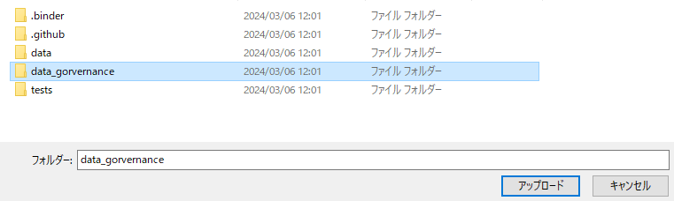
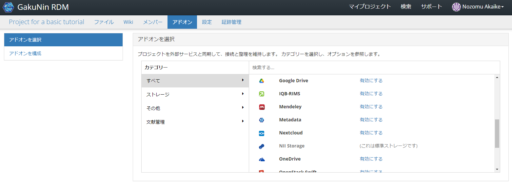

### データ管理計画を作成する

[前のステップ](./create_project.md)では、本チュートリアルに必要な研究用プロジェクトを作成しました。このステップでは、そのプロジェクトで扱う研究用のデータ管理計画（DMP）を作成します。本チュートリアルでは、プロジェクトメタデータを DMP として扱います。本ステップで実践する手順を以下に示します。

1. [dg-researchflowsのリポジトリをローカルにダウンロードする](#dg-researchflowsのリポジトリをローカルにダウンロードする)
1. [ファイルをアップロードする](#ファイルをアップロードする)
1. [ファイルメタデータを編集する](#ファイルメタデータを編集する)
1. [プロジェクトメタデータを作成する](#プロジェクトメタデータを作成する)
1. [プロジェクトメタデータの内容を入力する](#プロジェクトメタデータの内容を入力する)

#### 本サービスで作成する DMP に関する留意事項

***TODO:要相談***

* 本サービスで作成される DMP はあくまで試験的なものです。
* 本サービスの DMP 作成機能はテスト機能です。この DMP を助成機関に提出することはできません。
* 2023/8/30 時点では、作成された DMP を後から変更しても研究実行環境および実験実行環境に反映されない点に注意してください。
* **本サービスにおいて、研究開始時に作成された DMP を後から変更しないようにしてください**。

#### dg-researchflowsのリポジトリをローカルにダウンロードする

[dg-researchflowsのリポジトリ](https://github.com/NII-DG/dg-researchflows)にアクセスします。

ブランチ名が「master」になっていることを確認します。をクリックし、「Download ZIP」をクリックしてZIPファイルを任意の場所にダウンロードします。

ダウンロードしたZIPファイルを解凍します。

#### ファイルをアップロードする

[前のステップ](./create_project.md)で作成したプロジェクトのトップページに戻り、ページ上部の「ファイル」タブをクリックしてファイル管理画面（下図）に遷移します。

「NII Storage」を選択し、「フォルダのアップロード」をクリックします。

[前提作業](#dg-researchflowsのリポジトリをローカルにクローンする)で取得した「dg-researchflows」フォルダ内にある、「data_governance」「data」「.binder」フォルダをそれぞれアップロードします。（所要時間：約5分）

#### ファイルメタデータを編集する

ページ上部の「アドオン」タブをクリックし、アドオン「Metadata」を有効化します。

ページ上部の「ファイル」タブをクリックし、任意のファイルをメタデータ編集します。今回は「.binder」フォルダ内の「Dockerfile」ファイルを対象とします。

「.binder」フォルダ内の「Dockerfile」ファイルを選択し、ページ上部の「メタデータ編集」をクリックすることで、ポップアップ「ファイルメタデータの編集」が出現します。必須項目とされている項目に、任意の値を入力し、ポップアップ右下の「保存」をクリックします。

メタデータ登録ページにてファイルメタデータの値を入力します。本チュートリアルでは下表のように入力します。

|項目名|値|
|:---|:---|
| データ No. | 1 |
| データの名称 (日本語) | (シミュレーション) XFEL ポンプ–NIR プローブ実験 |
| Title (English) | (Simulation) NIR-pump-XFEL-probe experiments |
| 掲載日・掲載更新日 | （任意の年月日を入力してください。） |
| データの説明 (日本語) | (シミュレーション) 強力な近赤外レーザーパルスとX線自由電子レーザーパルスを使用した実験 |
| Description (English) | (Simulation) Experiments using intense NIR laser pulses and XFEL pulses|
| データの分野 | ライフサイエンス（プルダウンから選択） |
| データ種別 | シミュレーションデータ（プルダウンから選択） |
| 概略データ量 | 100GB |
| 管理対象データの利活用・提供方針 (有償/無償) | 無償（プルダウンから選択） |
| 管理対象データの利活用・提供方針 (ライセンス) | ライセンスなし（プルダウンから選択） |
| 管理対象データの利活用・提供方針 (引用方法等・日本語) | （管理対象データの利活用・提供方針を日本語で入力してください。） |
| Data utilization and provision policy (citation information, English) | （管理対象データの利活用・提供方針を英語で入力してください。）  |
| アクセス権 | 公開（プルダウンから選択） |
| 公開予定日 (公開期間猶予の場合) | （入力の必要はありません。） |
| リポジトリ情報 (日本語) | （リポジトリ情報を入力してください。） |
| Repository information (English) | （入力の必要はありません。） |
| リポジトリURL・DOIリンク | （入力の必要はありません。） |
| データ管理機関 (日本語) | （データ管理機関を日本語で入力してください。） |
| Hosting institution (English) | （データ管理機関を英語で入力してください。） |
| データ管理機関コード | （入力の必要はありません。） |
| データ管理者の e-Rad 研究者番号 | （入力の必要はありません。） |
| データ管理者 (日本語) | （ご自身の名前を日本語で入力してください。） |
| Data manager (English) | （ご自身の名前を英語で入力してください。） |
| データ管理者の所属組織名 (日本語) | （入力の必要はありません。） |
| Contact organization of data manager (English) | （入力の必要はありません。） |
| データ管理者の所属機関の連絡先住所 (日本語) | （入力の必要はありません。） |
| Contact address of data manager (English) | （入力の必要はありません。） |
| データ管理者の所属機関の連絡先電話番号 | （入力の必要はありません。） |
| データ管理者の所属機関の連絡先メールアドレス | （入力の必要はありません。） |
| 備考 (日本語) | （入力の必要はありません。） |
| Remarks (English) | （入力の必要はありません。） |
| メタデータのアクセス権 | 公開（プルダウンから選択） |

ファイルメタデータ編集後、メタデータが存在するファイルおよび上位階層のディレクトリに`{}`が付与されます。

#### プロジェクトメタデータを作成する

ページ上部の「メタデータ」タブをクリックし、ページ右上の「新規メタデータを作成」をクリックします。

出現したポップアップ「メタデータ様式を選択」の右下にある「メタデータを作成」をクリックし、「プロジェクトメタデータの登録」画面に遷移します。

#### プロジェクトメタデータの内容を入力する

メタデータ登録ページにてメタデータの値を入力します。本チュートリアルでは下表のように入力します。

|項目名|値|
|:---|:---|
| 資金配分機関情報 | (任意の値を半角英数字で入力してください。) |
| 体系的番号におけるプログラム情報コード | （入力の必要はありません。） |
| プログラム名 (日本語) | （入力の必要はありません。） |
| Program name (English) | （入力の必要はありません。） |
| 体系的番号 | (任意の値を入力してください。) |
| プロジェクト名 (日本語) | チュートリアル用プロジェクト |
| Project name (English) | Project for a basic tutorial |
| プロジェクトの分野 | （プルダウンから「ライフサイエンス \| 189」を選択してください。） |

ページ右上の「次へ→」をクリックします。
「登録データ一覧」から、[前提作業](#ファイルメタデータを編集する)でファイルメタデータを編集した「Dockerfile」を選択し、ページ右上の「内容確認」をクリックします。

入力した内容と選択したファイルを確認し、ページ右上の「登録」をクリックします。

一度ページを更新することで、作成したプロジェクトメタデータが表示されます。

「エクスポート」ボタンをクリックすることで、選択したフォーマットに対応したCSV形式の報告書をダウンロードできます（本チュートリアルでは使用しません）。

#### まとめ

本ステップではデータ管理計画（DMP）を試験的に作成する方法を試しました。試験的な機能ではあるものの、機械可読性（machine actionability）をより強く意識した形での DMP の作成を体験いただきました。

本ステップを完了したら[次のステップに進みましょう](./create_research_env.md)。
