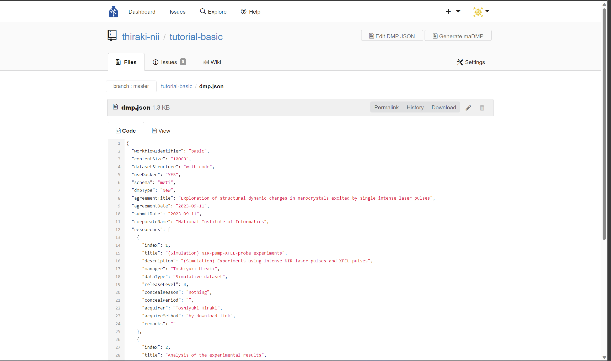
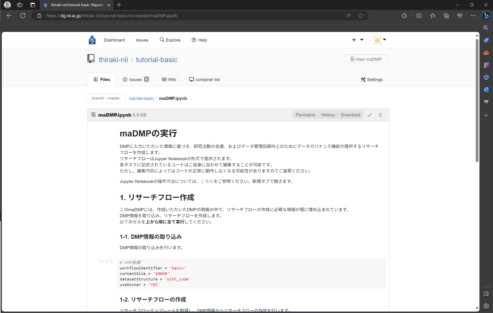

### MaDMP を作成する

本サービスでは DMP の内容の一部を利用して研究実行環境および実験実行環境を構築します。その構築のために DMP を機械可読な DMP (machine-actionable DMP, maDMP) に変換します。

まずは研究用リポジトリのトップページから `dmp.json` をクリックします。すると下図のようなページに遷移します。

このページにて右上にある「Generate maDMP」をクリックします。これにより maDMP（`maDMP.ipynb`）が生成されます。生成後、自動的に「container list」のページに遷移します（下図）。

なお、研究用リポジトリのトップページにて `maDMP.ipynb` をクリックすることで生成された maDMP の内容を確認できます（下図）。

#### まとめ

本ステップでは研究実行環境および実験実行環境の構築のベースとなる machine-actionable DMP (meDMP) を作成しました。本サービスでは DMP から maDMP への変換を研究者が能動的に行う体験を提供しております。とはいえ、maDMP 将来的には DMP の作成・更新の都度自動的に maDMP が作成

本ステップを完了したら[次のステップに進みましょう](./create_research_env.md)。
