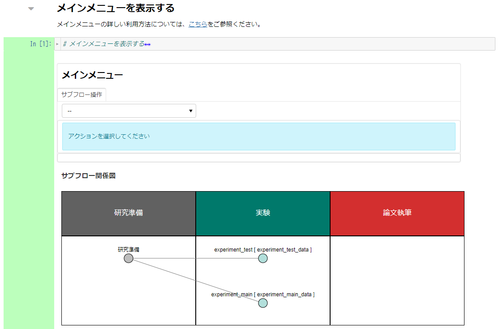
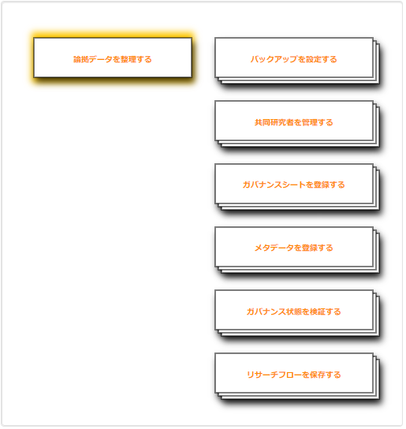
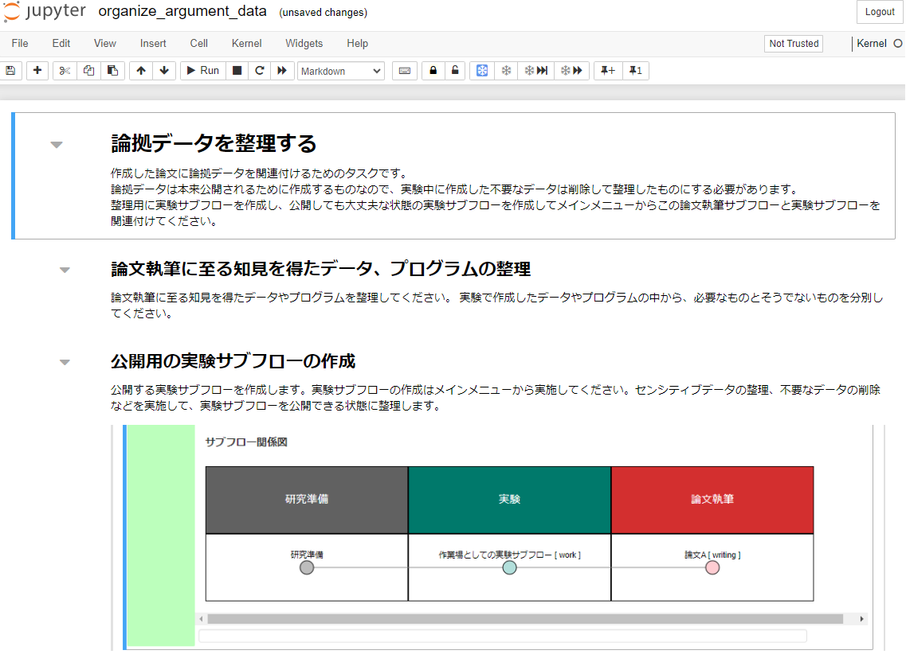

### 論文を執筆する

本ステップでは実験・解析結果を基に、論文の執筆を行います。本チュートリアルでは、論文は作成したものとし、主に論文と論拠データの関連付けや、整理する作業を行います。

本ステップで実践する手順を以下に示します。

1. [論文執筆環境を構築する](#論文執筆環境を構築する)
2. [解析を実施する](#解析を実施する)
3. [解析結果を同期する](#解析結果を同期する)
4. [解析の説明を記述する](#解析の説明を記述する)

#### 論文執筆環境を構築する

「メインメニューを表示」のコードセルを実行し、メインメニューを表示します。

|  |
|---|

「サブフロー操作」下部のプルダウンから、「サブフロー新規作成」を選択します。

サブフローの詳細設定を行います。本チュートリアルでは以下のように入力します。

|項目名|値|
|:---|:---|
| サブフロー種別 | 論文執筆（プルダウンから選択） |
| サブフロー名称 | tutorial_paper |
| データディレクトリ名 | tutorial_paper_data |
| 親サブフロー種別 | 実験（プルダウンから選択） |
| 親サブフロー選択 | （「experiment_main」をクリック） |

設定項目をすべて入力後、「＋新規作成」をクリックします。

|  |
|---|

「サブフロー関係図」の「論文執筆」にあるをクリックし、実験サブフローメニューに遷移します。

|  |
|---|

研究準備や実験と同様に、背景が黄色となっているフロー図に従って操作を行います。

|  |
|---|

#### 論拠データを整理する

論文執筆サブフローメニューにあるフロー中の「論拠データを整理する」をクリックし、論拠データ整理用のノートブックに遷移します。

|  |
|---|

#### 論文執筆に至る知見を得たデータ、プログラムの整理

実験で作成したデータやプログラムから、必要なものとそうでないものを整理します。

#### 公開用の実験サブフローの作成

必要に応じて、センシティブデータの整理や不要なデータの削除などを実施し、公開する実験サブフローを作成し、まとめます。

コードセルを実行することで、メインメニューへアクセスするボタンを表示できます。

#### 再現性の確認

前節で作成した公開用の実験サブフローに格納されているデータやプログラムが正しく動作するか、想定通りの結果になるかを確認します。

詳細は、[（オプション）Governed Run 機能を利用した計算実験の再現性の検証](./option_governed_run.md)で実施します。
検証の完了後に、本ノートブックへと戻り、タスクを継続してください。

<!-- 途中 -->

#### まとめ

<!-- まとめ -->

本ステップを完了したら[次のステップに進みましょう](./finish_research.md)。
