### 研究用プロジェクトを作成する

基本編の最初に、本チュートリアルで用いる研究用プロジェクトを作成します。本ステップで実践する手順を以下に示します。

1. [本サービスにアクセスする](#本サービスにアクセスする)
1. [本サービスにログインする](#本サービスにログインする)
1. [新しくプロジェクトを作成する](#新しくプロジェクトを作成する)
1. [パーソナルアクセストークンを発行する](#パーソナルアクセストークンを発行する)

#### 本サービスにアクセスする

まずは[本サービス](https://rdm.nii.ac.jp/)にアクセスします。すでにログイン済みでなければ、下図のように本サービスのトップページが表示されています。

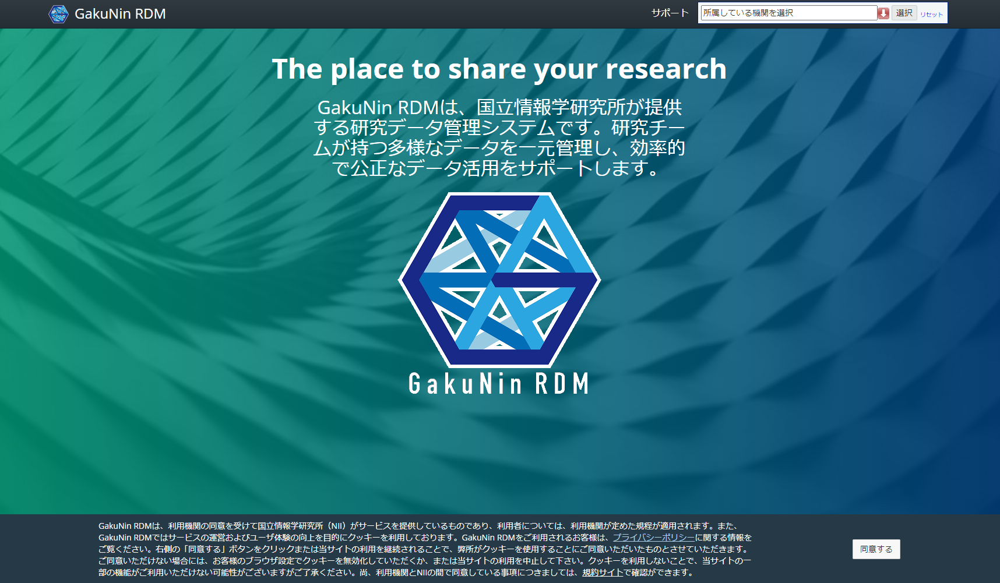

#### 本サービスにログインする

**すでにログイン済みの場合は本手順をスキップしてください。**

ページ右上のテキストボックスに所属している機関・IdPを入力、または「↓」ボタンからプルダウンで選択し、「選択」をクリックすることで、対応したログインページに遷移します。そのページにてご自身のアカウントでログインします。

ログインに成功するとプロフィール修正画面に遷移します（下図）。

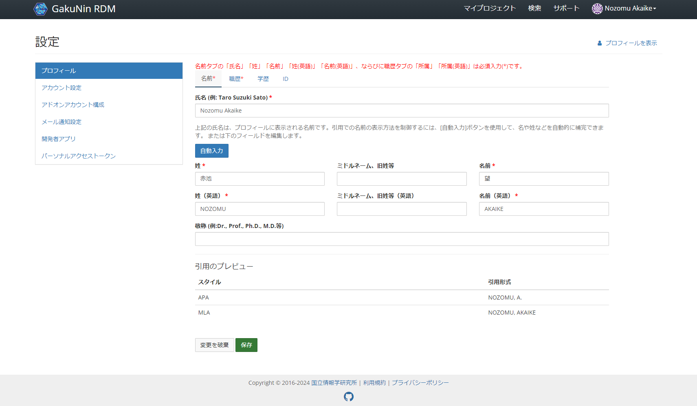

本サービス上部のメニューバーにて、左上に配置されている「GakuNin RDM」をクリックし、ダッシュボードのページに遷移します。

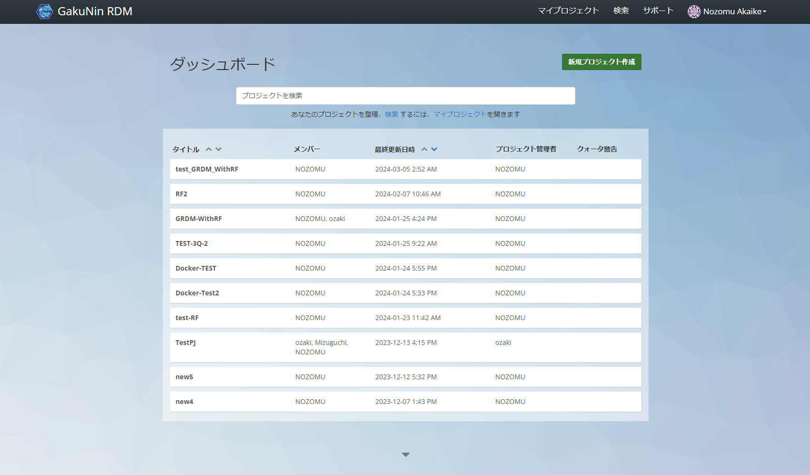

#### 新しくプロジェクトを作成する

ページ右上の「新規プロジェクト作成」をクリックすると、ポップアップが出現します(下図)。「詳細」をクリックし、設定項目を展開します。

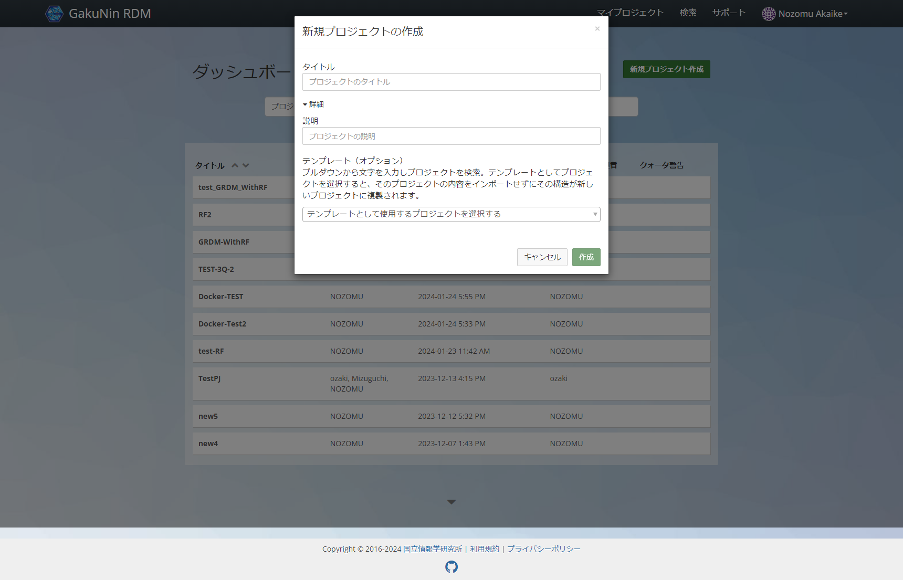

出現したポップアップにて必要な設定項目を入力します。本チュートリアルでは下表のように入力します。これらの情報はプロジェクト作成後に変更可能です（[「プロジェクトの設定変更」](#プロジェクトの設定変更)を参照）。各項目を入力し、「作成」をクリックします。

|項目名|値|
|:---|:---|
|タイトル（Title）|Project for a basic tutorial|
|説明（Description）|This project aims to explore the dynamic structural changes in nanocrystal excited by an intense laser pulse.|
|テンプレート（Template）|（選択無し）|

全ての情報を入力した後、ポップアップ下部にある「作成」ボタンをクリックします。これによりプロジェクトが生成されます（下図）。

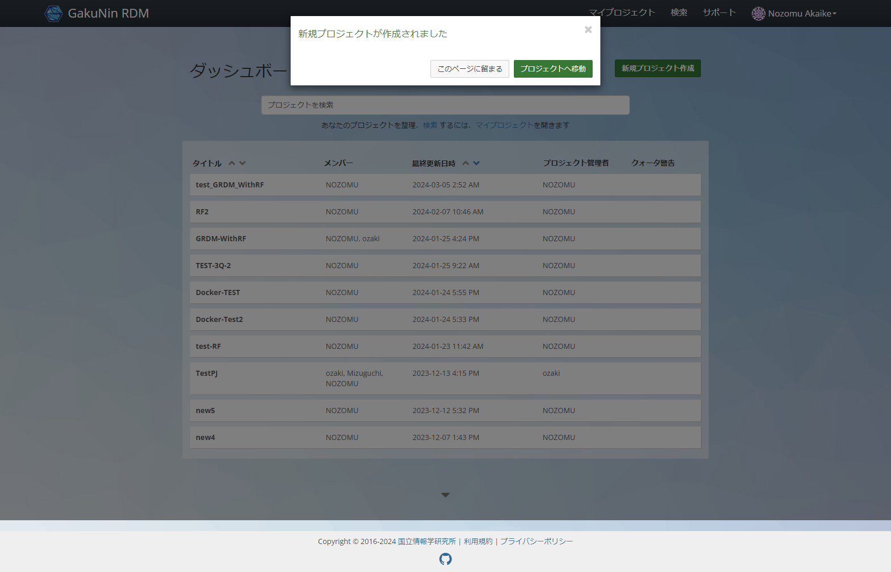

「プロジェクトへ移動」ボタンをクリックすることで、プロジェクトのトップページに遷移します（下図）。

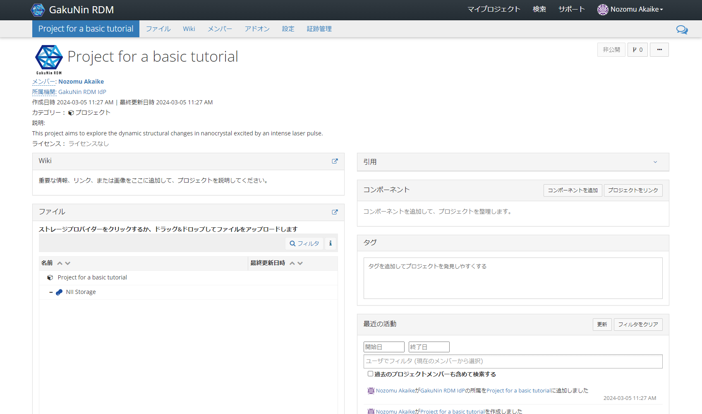

以上で本チュートリアルに必要なプロジェクトが作成できました。

#### プロジェクトの設定変更

プロジェクトのトップページ上部にある「設定」をクリックすると、プロジェクトの設定ページにアクセスできます。必要に応じて設定を変更してください。

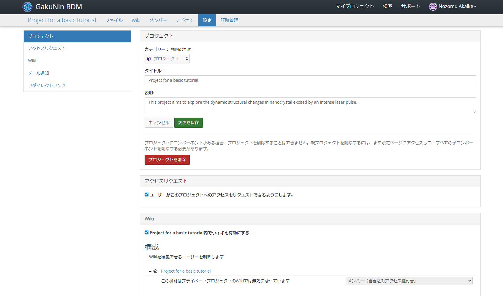

#### パーソナルアクセストークンを発行する

研究用プロジェクトの右上部にあるご自身の名前から、「設定」をクリックします。

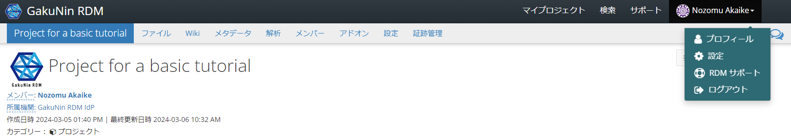

左部にある「設定」メニュー（下図）から、「パーソナルアクセストークン」をクリックします。

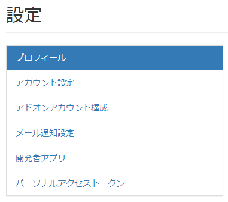

パーソナルアクセストークンを発行します。「パーソナルアクセストークン」の右部にある「新規トークン」をクリックします。

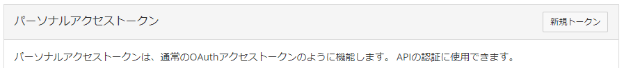

トークン名に任意の名前（本チュートリアルでは「tutorial_token」とします）を入力し、全てのスコープにチェックを付けます。

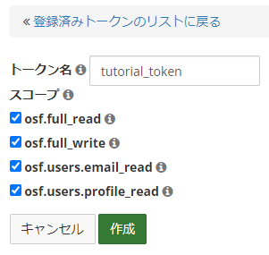

「作成」をクリックします。トークンIDは[次のステップ](./create_dmp.md)で使用するため、メモしてください。**この画面を離れると、トークンは二度と表示されません。**

ページ左上部の「GakuNin RDM」からダッシュボードに遷移し、作成した研究用プロジェクトに戻ります。

#### まとめ

本ステップでは研究データを管理するプロジェクトを作成する方法を試しました。

本ステップを完了したら[次のステップに進みましょう](./create_dmp.md)。
