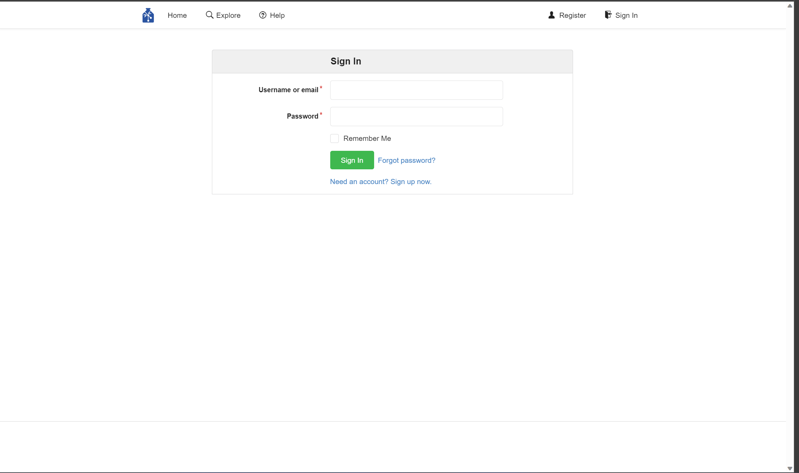
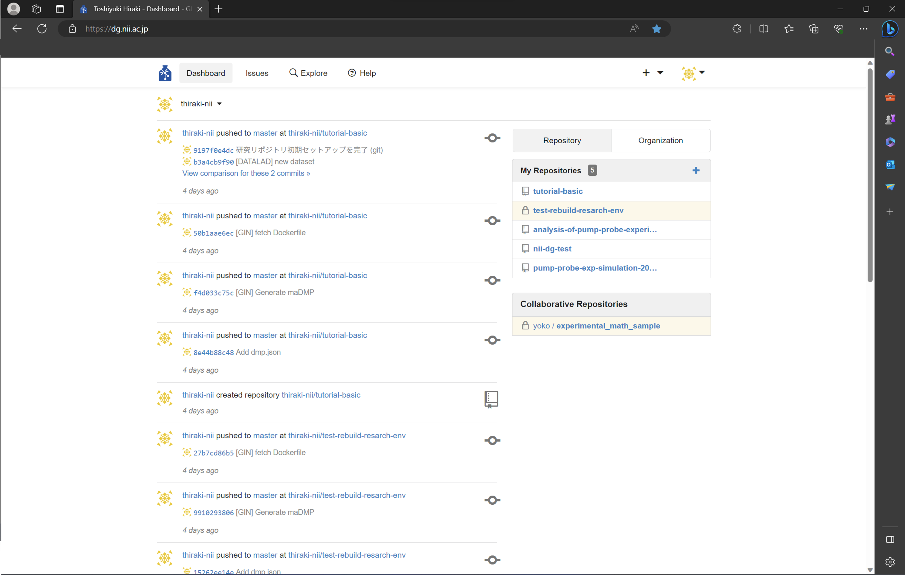
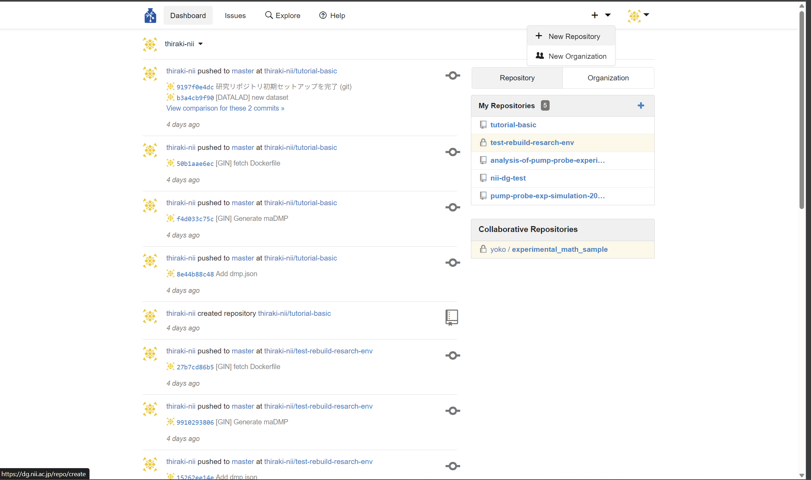
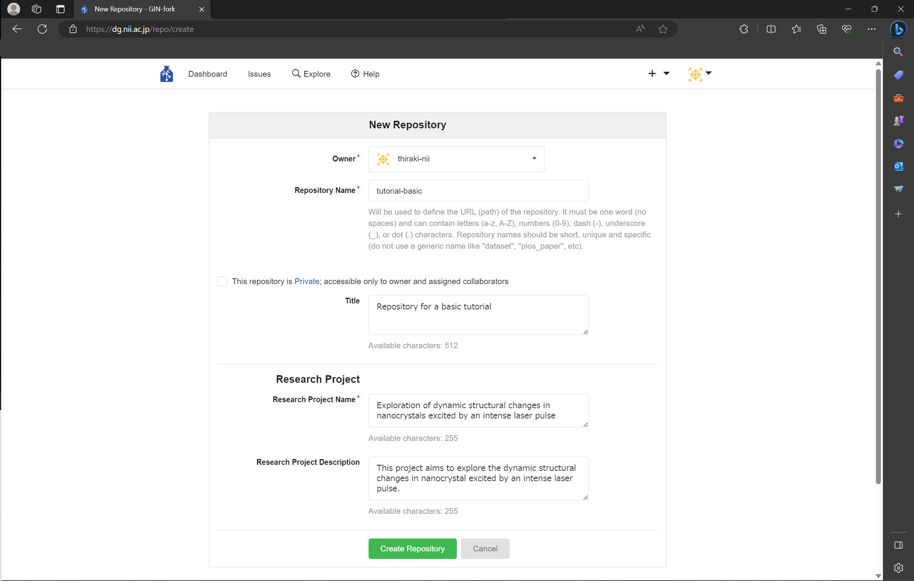
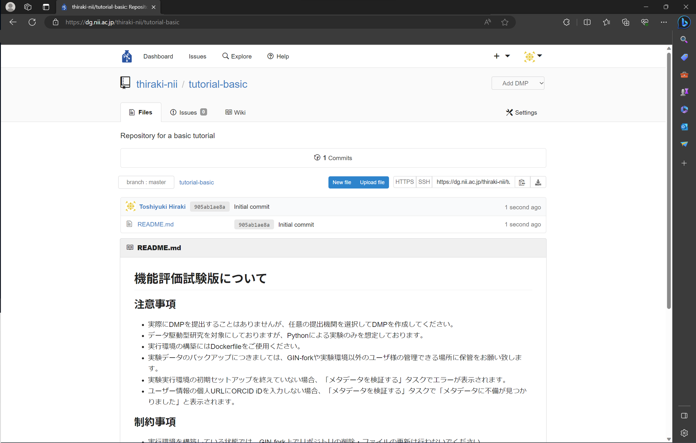
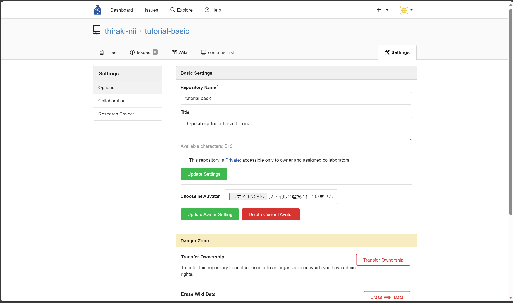

### 研究用リポジトリを作成する

基本編の最初に、本チュートリアルで用いる研究用リポジトリを作成します。本ステップで実践する手順を以下に示します。

1. [本サービスにアクセスする](#本サービスにアクセスする)
1. [本サービスにログインする](#本サービスにログインする)
1. [新しくリポジトリを作成する](#新しくリポジトリを作成する)

#### 本サービスにアクセスする

まずは[本サービス](https://dg.nii.ac.jp/)にアクセスします。すでにログイン済みでなければ、下図のように本サービスのトップページが表示されています。

#### 本サービスにログインする

**すでにログイン済みの場合は本手順をスキップしてください。**

ページ右上の「サインイン/Sign in」をクリックし、ログインページに遷移します（下図）。そのページにてご自身のアカウントでログインします。

ログインに成功するとダッシュボードのページに遷移します（下図）。

#### 新しくリポジトリを作成する

本サービス上部のメニューバーにて、右上に配置されている「＋」マークをクリックしてプルダウンメニューを開きます。プルダウンメニュー中の「＋ New Repository」をクリックします。

リポジトリ作成画面にて必要な設定項目の９値を入力します（下図）。本チュートリアルでは下表ように入力します。これらの情報はリポジトリ作成後に変更可能です（[「リポジトリの設定変更」](#リポジトリの設定変更)を参照）。

|項目名|値|
|:---|:---|
|リポジトリ名（Repository Name）|tutorial-basic|
|プライベートリポジトリの選択|チェックを外す（パブリックにする）|
|タイトル（Title）|Repository for a basic tutorial|
|研究プロジェクト名（Research Project Name）|Exploration of dynamic structural changes in nanocrystals excited by an intense laser pulse
|研究プロジェクトの説明（Research Project Description）|This project aims to explore the dynamic structural changes in nanocrystal excited by an intense laser pulse.|

全ての情報を入力した後、ページ下部にある「Create Repository」ボタンをクリックします。これによりリポジトリが生成され、リポジトリのトップページに遷移します（下図）。

以上で本チュートリアルに必要なリポジトリが作成できました。

#### リポジトリの設定変更

リポジトリのトップページにある「Setting」をクリックすると、リポジトリの設定ページにアクセスできます。必要に応じて設定を変更してください。

#### まとめ

本ステップでは研究データを管理するリポジトリを作成する方法を試しました。基本的には GitHub 等の Git リポジトリサービスと同様の手順でリポジトリを作成することができます。

本ステップを完了したら[次のステップに進みましょう](./create_dmp.md)。
