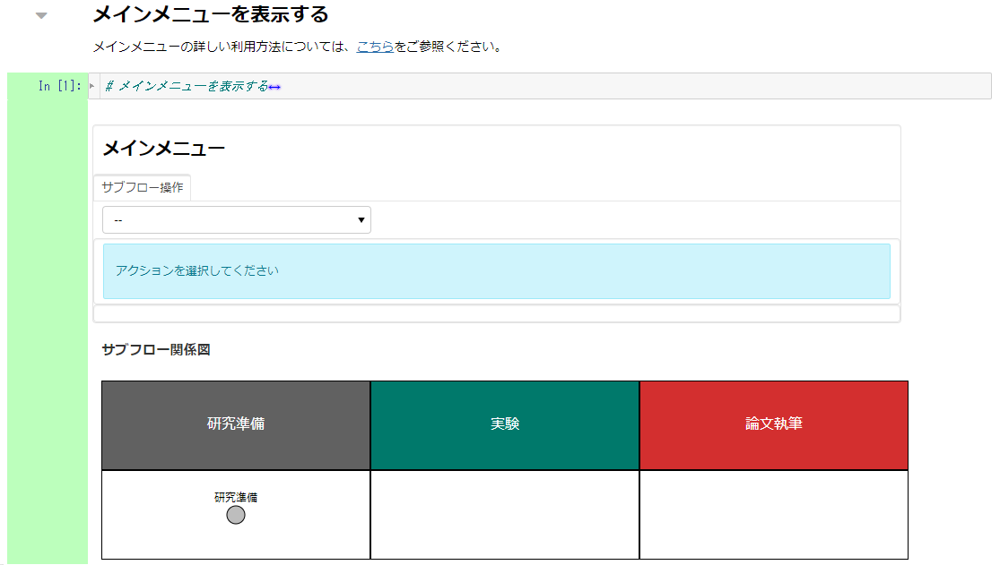

### 研究実行環境を構築する

本ステップでは解析環境の構築を行います。本ステップで実践する手順を以下に示します。

1. [解析環境を構築する](#解析環境を構築する)

#### 本ステップで体験していただくこと

* GRDM のコード付帯機能を利用する研究実行環境の構築。

#### 解析環境を構築する

研究準備サブフローのサブフローメニューより「解析環境を構築する」をクリックし、遷移します。

「解析環境を構築する手法を選択する」のコードセルを実行します。本チュートリアルではGakunin RDMの解析環境をこのまま利用して研究を進めます。

「解析基盤を利用した本環境を解析環境とする」を選択してください。表示された「サブフローメニューを表示する」をクリックしてサブフローメニューに遷移します。

本ステップでは実施しませんが、他の手法として、学認クラウドオンデマンド構築サービス（ocs）を利用してmdxなどで新しく解析環境を構築することもできます。その場合は「OCSで解析環境を構築する」を選択し、以降のセルを実施してください。

サブフローメニューを表示し、完了した2つのフローに青いチェックマークが付いていることを確認します。

「メインメニューへ」のコードセルを実行し、メインメニューへ遷移します。

「メインメニューを表示」のコードセルを実行します。

「アクションを選択してください」を表示され、サブフローの操作が可能になっていることを確認します。

#### まとめ

本ステップでは研究実行環境を構築する方法を試しました。自身で同じことをしようとすると、秘密鍵の設定や、 git コマンドの利用などの手間がかかります。本サービスではそれらを自動化し、ユーザーの操作を簡便化（少しの入力とボタンクリックのみ）しております。

本ステップを完了したら[次のステップに進みましょう](./carry_out_test_experiment.md)。
