### 研究実行環境を構築する

本ステップでは[前のステップ](./create_dmp.md)で生成された DMP（プロジェクトメタデータ）を利用して研究実行環境の構築および初期設定を行います。本ステップで実践する手順を以下に示します。

1. [事前準備](#事前準備)
1. [研究実行環境を構築する](#研究実行環境を構築する)
1. [研究実行環境の初期セットアップを行う](#研究実行環境の初期セットアップを行う)

#### 本ステップで体験していただくこと

* GRDM のコード付帯機能を利用する研究実行環境の構築。

#### 事前準備

研究用プロジェクトの右上部にあるご自身の名前から、「設定」をクリックします。

左部にある「設定」メニュー（下図）から、「パーソナルアクセストークン」をクリックします。

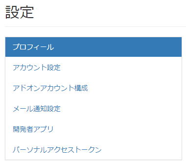

パーソナルアクセストークンを発行します。「パーソナルアクセストークン」の右部にある「新規トークン」をクリックします。

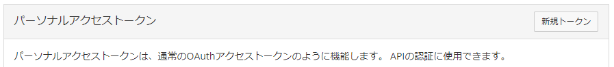

トークン名に任意の名前（本チュートリアルでは「tutorial_token」とします）を入力し、全てのスコープにチェックを付けます。

「作成」をクリックします。トークンIDは[後のステップ](#研究実行環境の初期セットアップを行う)で使用するため、メモしてください。**この画面を離れると、トークンは二度と表示されません。**

ページ左上部の「GakuNin RDM」からダッシュボードに遷移し、作成した研究用プロジェクトに戻ります。

#### 研究実行環境を構築する

研究用プロジェクトの上部にある「アドオン」タブをクリックします。「アドオンを選択」から、「GakuNin Federated Computing Services (Jupyter)」を有効化します。

アドオンを有効化したことにより、ページ上部に「解析」タブが出現します。「解析」タブをクリックします。

ページ右側の「`新しい解析環境を作成: https://binder.cs.rcos.nii.ac.jp`」をクリックします。ビルド状況が「ready」になるまでお待ちください。

この操作により、ページ上部の「私の解析環境」に解析環境が出現します。

「起動」にあるアイコンをクリックすることで、作成した解析環境に遷移します。

「data_gorvernance」フォルダ、「researchflow」フォルダを開き、「main.ipynb」をクリックし、メインメニューに遷移します。

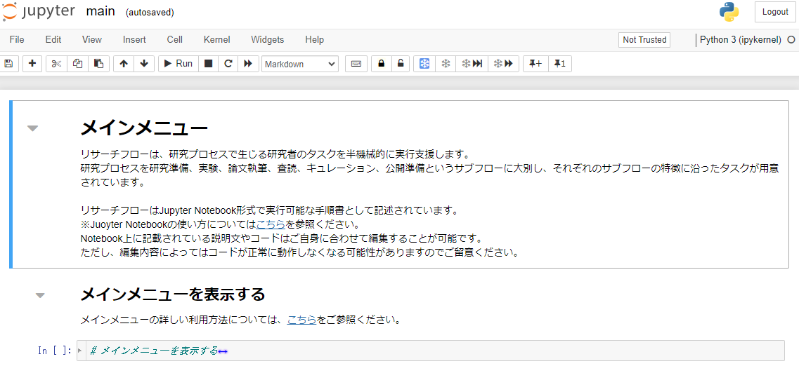

#### 研究実行環境の初期セットアップを行う

前節の最後に開かれたメインメニューのページにて、上から順にセルを実行することで処理が進みます。セルの実行方法は Jupyter Notebook における通常のセルの実行方法と同じです。セルの実行が完了すると下図のようになります。

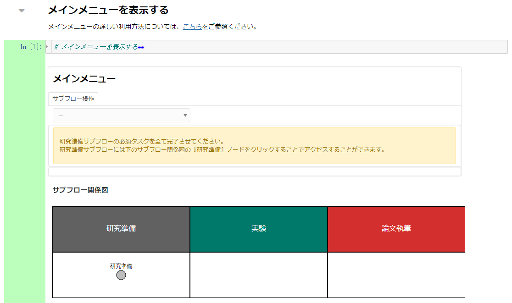

「サブフロー関係図」の「研究準備」のをクリックし、研究準備サブフローメニューに遷移します。

「サブフローメニューを表示」のコードセルを実行し、サブフローメニューを表示します。

背景が黄色となっているフロー図に従って操作を行います。「研究データ管理計画を立てる」をクリックし、次のフローに遷移します。

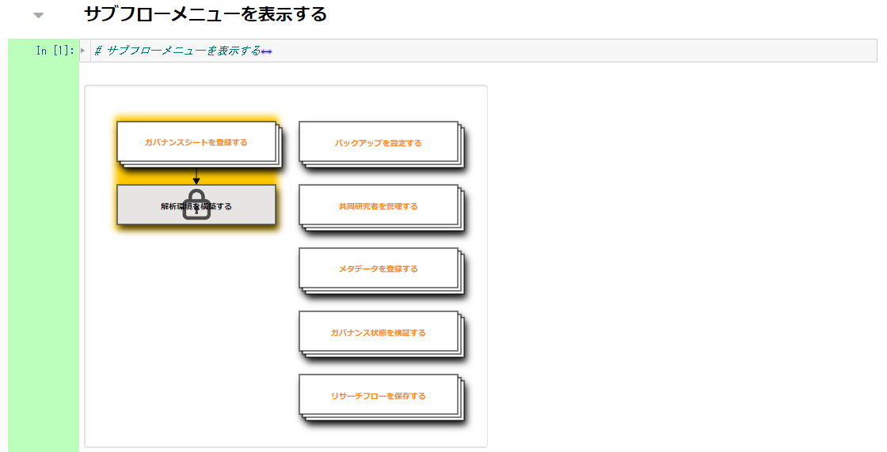

上から順にセルを実行します。

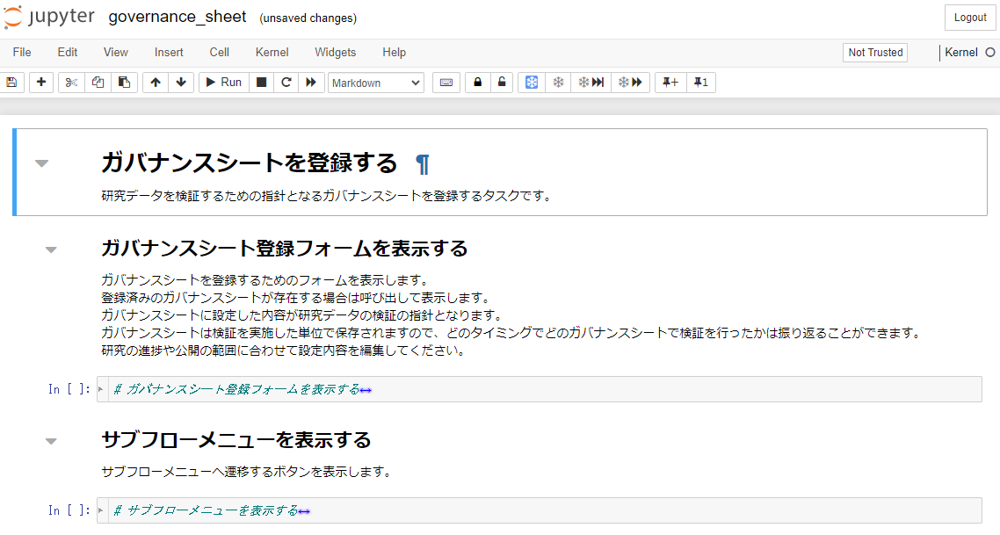

「1. 研究データ管理計画（DMP）を取得する」では、[前のステップ](./create_dmp.md)で生成された DMP（プロジェクトメタデータ）を利用します。表示されたテキストボックスに[事前準備](#事前準備)で作成したパーソナルアクセストークンを入力します。

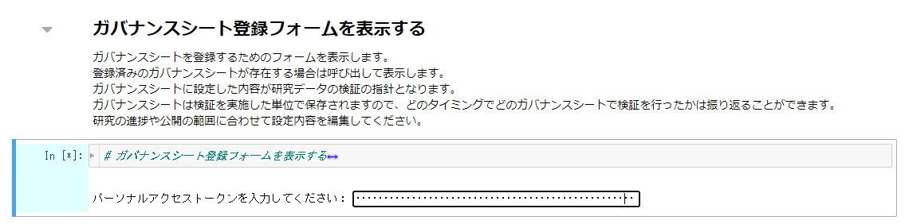

作成した研究用プロジェクトが表示されます。研究用プロジェクトを選択し、「選択」をクリックします。

「2. DGカスタマイズプロパティの設定」のコードセルを実行します。表示された全てのチェックボックスにチェックを入れ、をクリックします。

「3. GRDMに実行結果を同期」のコードセルを実行します。

表示されたテキストボックスに[事前準備](#事前準備)で作成したパーソナルアクセストークンを入力します。

「保存する」をクリックし、完了するまで待機します。

「サブフローメニューへ」のコードセルを実行し、サブフローメニューに遷移します。
再度「サブフローメニューを表示」のコードセルを実行し、サブフローメニューを表示します。完了したフローには青いチェックマークが表示されます。

「解析環境を構築する」をクリックし、次のフローに遷移します。

「1. OCSテンプレートの取得をする」のコードセルを実行し、実行が完了するまで待機します。

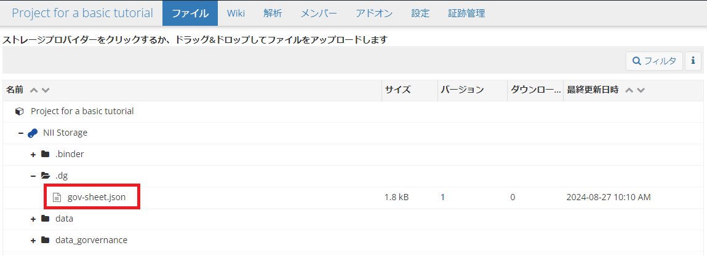

「2. 解析環境を構築する環境を準備する」のコードセルを実行し、本チュートリアルでは「その他」を選択します。

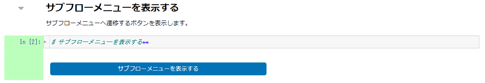

「3. 解析環境の構築手順を選択する」のコードセルを実行し、本チュートリアルでは「Gakunin RDMの解析基盤を利用する」を選択します。

「4. 構築手順を保存する」のコードセルを実行し、実行が完了するまで待機します。

「5.Gakunin RDMに実行結果を同期」のコードセルを実行します。

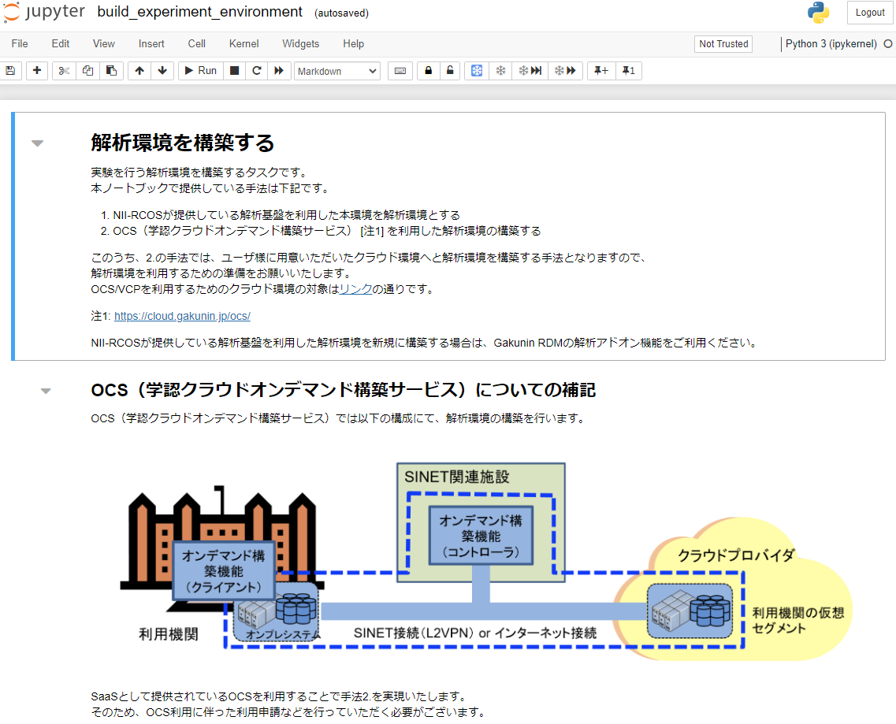

表示されたテキストボックスに[事前準備](#事前準備)で作成したパーソナルアクセストークンを入力します。

「保存する」をクリックし、完了するまで待機します。

「サブフローメニューへ」のコードセルを実行し、サブフローメニューに遷移します。

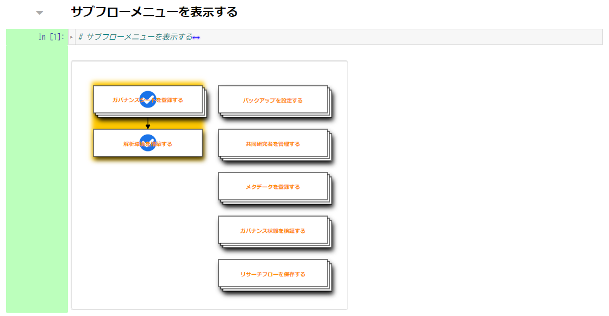

サブフローメニューを表示し、完了した2つのフローに青いチェックマークが付いていることを確認します。

「メインメニューへ」のコードセルを実行し、メインメニューへ遷移します。

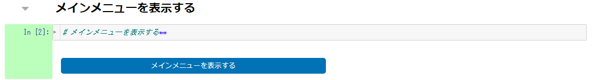

「メインメニューを表示」のコードセルを実行します。

「アクションを選択してください」を表示され、サブフローの操作が可能になっていることを確認します。

#### まとめ

本ステップでは研究実行環境を構築する方法を試しました。自身で同じことをしようとすると、秘密鍵の設定や、 git コマンドの利用などの手間がかかります。本サービスではそれらを自動化し、ユーザーの操作を簡便化（少しの入力とボタンクリックのみ）しております。

本ステップを完了したら[次のステップに進みましょう](./carry_out_test_experiment.md)。
