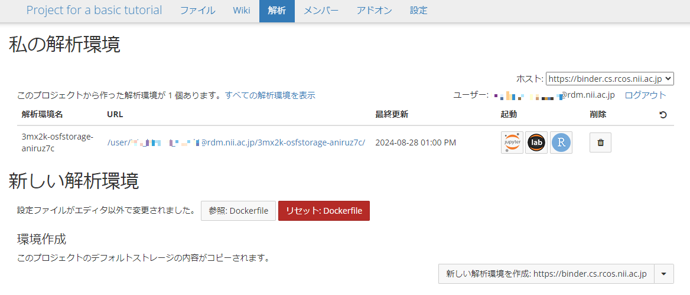

### 研究を終了する
<!-- GRDM上で削除すれば終わり -->
基本編の最後のステップとして、本サービスでの研究終了時の研究実行環境を削除する手順を実践します。この操作はボタンクリックと少しの画面遷移のみで完結します。

「GakuNin RDM」のプロジェクトのトップページに戻り、ページ上部の「解析」をクリックしてページを移動します。

|  |
|---|

「削除」にあるアイコンをクリックすることで、作成した研究実行環境が削除されます。

#### まとめ

本ステップでは研究実行環境を削除する方法を試しました。本ステップのポイントは以下の通りです。

* 本サービスを利用すると、ボタンクリックと少しの画面遷移のみで研究実行環境が削除できる。

本ステップを完了したら次のいずれかに進みましょう。

* [基本編のまとめ](../summary.md)
