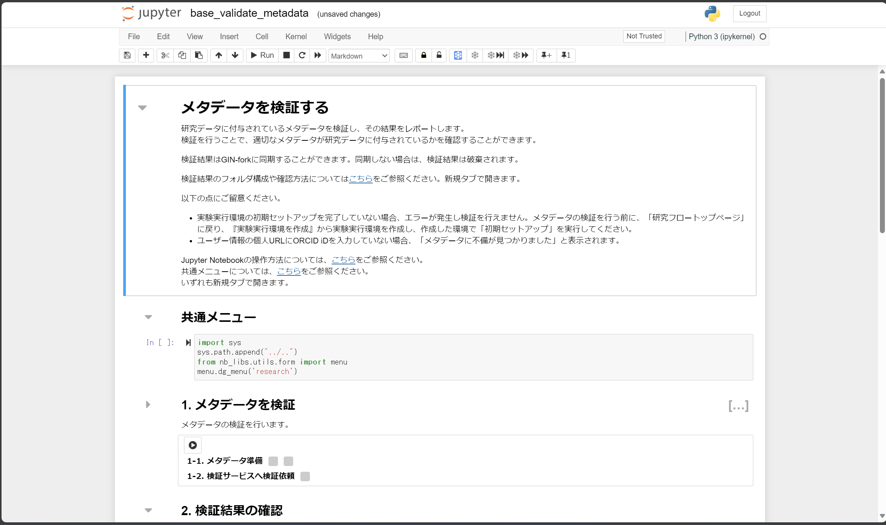
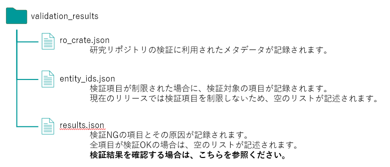

### メタデータの状態の検証を行う

メタデータの状態の検証はいつでも可能です。今回は全ての実験および解析が終わり、論文執筆フェーズに入る前の確認というシーンを想定して検証を行うことにします。

本ステップでは、ここまでで生成された研究データの管理状態をモニタリング機能を用いて検証します。

#### 検証される項目

2023/8/30 時点では以下の項目が検証されます。

* DMP 中の値の存在性とフォーマット
* 研究用リポジトリ中の研究データの総データサイズ
* 研究用リポジトリ中の研究データのメタデータの取得可否

検証ルールにつては[モニタリング機能のリポジトリ中にあるメタデータスキーマ](https://github.com/NII-DG/nii-dg/tree/main/nii_dg/schema)をご参照ください。

#### 検証フロー

本サービスでは次のフローで研究データの管理状態を検証します。

1. メタデータスキーマに基づき研究データのメタデータを収集し、パッケージを生成する。
2. 生成されたパッケージをモニタリングサービスに入力する。
3. モニタリング機能が生成されたパッケージに含まれるメタデータスキーマのリンクを参照しつつ、それぞれのメタデータスキーマに対応する検証ルールをメタデータが満たしているかどうか検証する。
4. 検証完了後、検証結果をモニタリングサービスから取得する。

**この検証におけるユーザーの操作はボタンクリック操作のみです**。

#### 検証を実施する

研究フロートップページの研究フロー図にある「メタデータを検証する」をクリックし、検証用ノートブック（下図）に遷移します。

「1. メタデータを検証」セクション中のセルを実行します。これにより次の処理が自動的に実施されます。

1. 研究用リポジトリに含まれる研究データのメタデータを収集し、RO-Crate 形式でパッケージングする。
1. 生成された RO-Crate（メタデータパッケージ）をモニタリングサービスに入力し研究データの管理状態の検証を依頼する。

メタデータパッケージのサイズや検証ルールによっては、検証が完了するまで時間がかかることがあります。

続いて「2. 検証結果の確認」セクション中のセルを実行します。これにより、先ほどモニタリングサービスに依頼した検証の結果を取得します。

「3-1. 検証結果の記録の選択」セクション中のセルを実行し、現れるフォームを利用して検証結果を研究用リポジトリに同期するかどうか選択します。基本的には同期することが望ましいです。検証結果が NG でありその原因の解決が容易である場合には、検証結果を一度破棄するということもあり得るでしょう。

「3-1. 検証結果の記録の選択」セクションにて検証結果を同期することを選択していれば、「3-2. 研究リポジトリに同期」セクション中のセルを実行することで検証結果を研究用リポジトリに同期できます。

最後に研究フロートップページに遷移します。

#### 検証結果を確認する

検証結果は `./validation_results` ディレクトリに格納されます。このディレクトリ格納されるファイルの説明は下図（「[(先行利用)データガバナンス機能を利用した研究・実験の進め方](https://support.rdm.nii.ac.jp/usermanual/60/)」より引用）をご参照ください。

#### まとめ

本ステップではメタデータの状態の検証を行う方法を試しました。**本サービスを利用すると、ユーザーは「一つ一つの研究データの状態が研究プロジェクト管理上の制約（検証ルール）を満たしているかどうかを手動および目視で行う」という労働をする必要がありません**。これがデータガバナンス機能を利用する最も大きな利点の一つです。

本ステップを完了したら[次のステップに進みましょう](./carry_out_analysis.md)。
