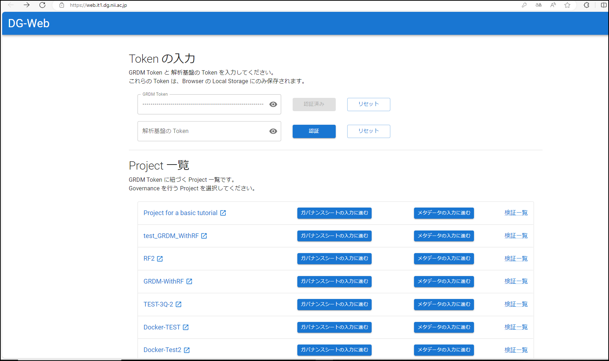

### メタデータの状態の検証を行う

メタデータの状態の検証はいつでも可能です。今回は全ての実験および解析が終わり、論文執筆フェーズのシーンを想定して検証を行うことにします。

本ステップでは、ここまでで生成された研究データの管理状態をモニタリング機能を用いて検証します。
<!-- 途中 -->
#### 検証される項目

2024/3/31 時点では以下の項目が検証されます。

* DMP 中の値の存在性とフォーマット
* 研究用リポジトリ中の研究データの総データサイズ
* 研究用リポジトリ中の研究データのメタデータの取得可否

検証ルールにつては[モニタリング機能のリポジトリ中にあるメタデータスキーマ](https://github.com/NII-DG/nii-dg/tree/main/nii_dg/schema)をご参照ください。

#### 検証フロー

本サービスでは次のフローで研究データの管理状態を検証します。

1. メタデータスキーマに基づき研究データのメタデータを収集し、パッケージを生成する。
2. 生成されたパッケージをモニタリングサービスに入力する。
3. モニタリング機能が生成されたパッケージに含まれるメタデータスキーマのリンクを参照しつつ、それぞれのメタデータスキーマに対応する検証ルールをメタデータが満たしているかどうか検証する。
4. 検証完了後、検証結果をモニタリングサービスから取得する。

**この検証におけるユーザーの操作はボタンクリック操作と項目の入力です**。

#### 検証を実施する

DG-Webに接続し、[研究実行環境を構築する](create_research_env.md)の手順で取得したトークンIDを「GRDM Token」欄に入力して認証してください。

認証後、Project一覧が表示されます。

#### 検証結果を確認する

検証結果は `./validation_results` ディレクトリに格納されます。このディレクトリ格納されるファイルの説明は下図（「[(先行利用)データガバナンス機能を利用した研究・実験の進め方](https://support.rdm.nii.ac.jp/usermanual/60/)」より引用）をご参照ください。

#### まとめ

本ステップではメタデータの状態の検証を行う方法を試しました。**本サービスを利用すると、ユーザーは「一つ一つの研究データの状態が研究プロジェクト管理上の制約（検証ルール）を満たしているかどうかを手動および目視で行う」という労働をする必要がありません**。これがデータガバナンス機能を利用する最も大きな利点の一つです。

本ステップを完了したら[元のステップに戻りましょう](./create_paper.md)。
