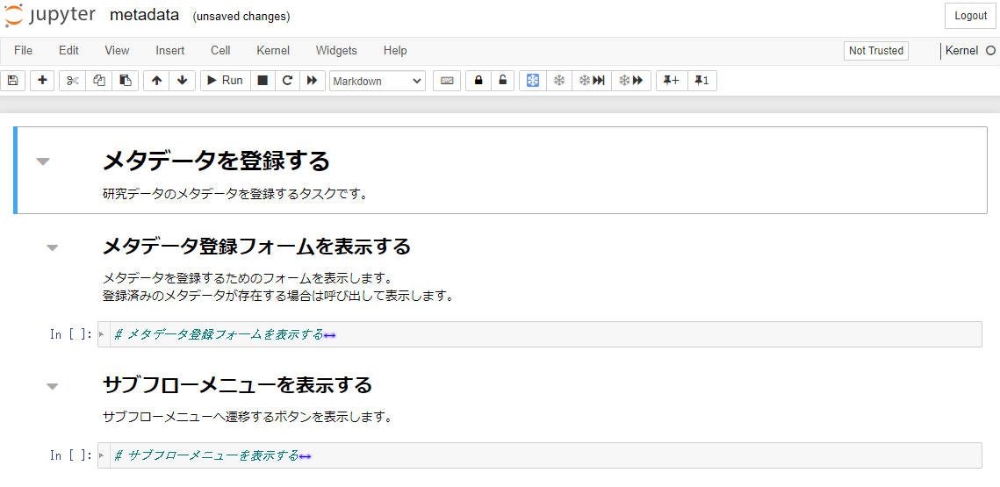
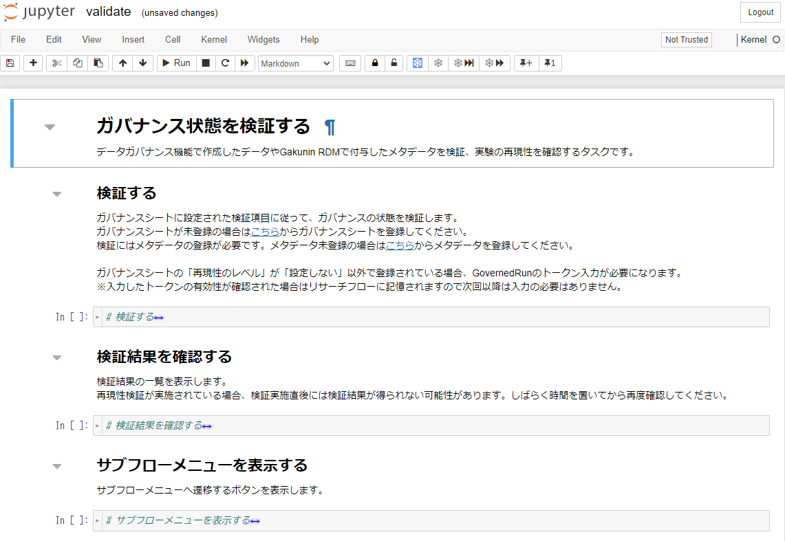

### メタデータの状態の検証を行う

メタデータの状態の検証はいつでも可能です。今回は全ての実験および解析が終わり、論文執筆フェーズのシーンを想定して検証を行うことにします。

本ステップでは、ここまでで生成された研究データの管理状態をモニタリング機能を用いて検証します。

#### 検証される項目

2024/6/30 時点では以下の項目が検証されます。

* 研究用プロジェクトに登録したメタデータ
* （オプション）研究用プロジェクト中の計算実験データの再現性

<!-- TODO: DG-Webがprivate権限のため8/21時点では記載を保留 -->
<!--
検証ルールについては[モニタリング機能のリポジトリ中にある検証ルール](https://github.com/NII-DG/nii-dg-web/tree/main/src/core/rules)をご参照ください。
-->

#### 検証フロー

本サービスでは次のフローで研究データの管理状態を検証します。

1. 各研究支援機関（FA）や所属の学術機関などから指定されているルールに従ってメタデータを登録する。
2. モニタリング機能がガバナンスシートに対応する検証ルールをメタデータが満たしているかどうか検証する。
3. 検証完了後、検証結果をモニタリングサービスから取得する。

**この検証におけるユーザーの操作はボタンクリック操作と項目の入力です**。

本ステップで実践する手順を以下に示します。

  1. [メタデータを登録する](#メタデータを登録する)
  1. [検証を実施する](#検証を実施する)
  1. [検証結果を確認する](#検証結果を確認する)
  * [（オプション）ガバナンスシートを確認・再設定する](#オプションガバナンスシートを確認再設定する)
  * [（オプション）DG-Webでメタデータを検証する](#オプションdg-webでメタデータを検証する)
  * [（オプション）Run Crate を利用した再現性の検証](#オプションrun-crate-を利用した再現性の検証)
  * [まとめ](#まとめ)

### メタデータを登録する

各研究支援機関（FA）や所属の学術機関などから指定されているルールに従ってメタデータを登録します。

リサーチフローの実験サブフローメニューより「メタデータを登録する」をクリックし、遷移します。

|  |
|---|

「メタデータ登録フォームを表示する」のセルを実行し、メタデータ登録フォームを表示します。

|  |
|---|

セルの左端にカーソルを合わせると「click to scroll output, double click to hide」と表示されます。セルをクリックしてフォームの全体を表示します。

|  |
|---|

メタデータの入力を行います。

本ステップでは以下の項目に値を入力します。

<table>
<thead>
<tr><th colspan=2>項目名</th><th>値</th></tr>
</thead>
<tbody>
<tr><td colspan=3><b>研究に関するメタデータの入力</b></td></tr>
<tr><td colspan=2>プロジェクト名</td><td>チュートリアルプロジェクト</td></tr>
<tr><td colspan=2>プロジェクトの説明</td><td>チュートリアル用のプロジェクト</td></tr>
<tr><td colspan=2>プロジェクトの分野</td><td>（プルダウンから選択）ライフサイエンス</td></tr>
<tr><td colspan=2>プロジェクトのリンク</td><td>http&#58;//tutorial.ac.jp/pj/2024/tutorial/</td></tr>
<tr><td colspan=2>プロジェクトのRAiD</td><td>（空欄とします）</td></tr>
<tr><td colspan=2>プロジェクトの開始日</td><td>（空欄とします）</td></tr>

<tr><td colspan=3><b>プロジェクトメンバー</b></td></tr>
<tr><td colspan=2>名前</td><td>研究太郎</td></tr>
<tr><td colspan=2>メールアドレス</td><td>taro_k@tutorial.ac.jp</td></tr>
<tr><td colspan=2>ORCID ID</td><td>（空欄とします）</td></tr>
<tr><td colspan=2>e-Rad 研究者番号</td><td>（空欄とします）</td></tr>
<tr><td colspan=2>所属先（名前）</td><td>チュートリアル研究所</td></tr>
<tr><td colspan=2>所属先（住所）</td><td>（空欄とします）</td></tr>
<tr><td colspan=2>所属先（ROR ID）</td><td>（空欄とします）</td></tr>

<tr><td colspan=3><b>プロジェクトに紐づくDMP</b></td></tr>
<tr><td colspan=2>データ番号</td><td>1</td></tr>
<tr><td colspan=2>データの説明</td><td>チュートリアル用の実験</td></tr>
<tr><td rowspan=7>データの作成者</td><td>名前</td><td>研究太郎</td></tr>
<tr><td>メールアドレス</td><td>taro_k@tutorial.ac.jp</td></tr>
<tr><td>ORCID ID</td><td>（空欄とします）</td></tr>
<tr><td>e-Rad 研究者番号</td><td>（空欄とします）</td></tr>
<tr><td>所属先（名前）</td><td>チュートリアル研究所</td></tr>
<tr><td>所属先（住所）</td><td>（空欄とします）</td></tr>
<tr><td>所属先（ROR ID）</td><td>（空欄とします）</td></tr>

<tr><td rowspan=7>データ管理者</td><td>名前</td><td>管理次郎</td></tr>
<tr><td>メールアドレス</td><td>jiro_k@tutorial.ac.jp</td></tr>
<tr><td>ORCID ID</td><td>（空欄とします）</td></tr>
<tr><td>e-Rad 研究者番号</td><td>（空欄とします）</td></tr>
<tr><td>所属先（名前）</td><td>チュートリアル研究所</td></tr>
<tr><td>所属先（住所）</td><td>（空欄とします）</td></tr>
<tr><td>所属先（ROR ID）</td><td>（空欄とします）</td></tr>

<tr><td rowspan=3>データ管理機関</td><td>名前</td><td>チュートリアル研究所</td></tr>
<tr><td>住所</td><td>（空欄とします）</td></tr>
<tr><td>ROR ID</td><td>（空欄とします）</td></tr>

<tr><td rowspan=3>データのライセンス情報</td><td>名前</td><td>（空欄とします）</td></tr>
<tr><td>URL</td><td>（空欄とします）</td></tr>
<tr><td>コピーライト表記</td><td>（空欄とします）</td></tr>

<tr><td rowspan=11>データのアクセス権情報</td><td>conditionOfAccess</td><td>未選択</td></tr>
<tr><td>dataAvailable</td><td>（空欄とします）</td></tr>
<tr><td>dataAccessRequirements</td><td>（空欄とします）</td></tr>
<tr><td>概要サイズ</td><td>（空欄とします）</td></tr>
<tr><td>連絡先</td><td>（空欄とします）</td></tr>
<tr><td>データの生成方法</td><td>（空欄とします）</td></tr>
<tr><td>データのフォーマット</td><td>（空欄とします）</td></tr>
<tr><td>DMP種別・フォーマット名</td><td>（空欄とします）</td></tr>
<tr><td>DMPフォーマット提供機関（名前）</td><td>（空欄とします）</td></tr>
<tr><td>DMPフォーマット提供機関（住所）</td><td>（空欄とします）</td></tr>
<tr><td>DMPフォーマット提供機関（ROR ID）</td><td>（空欄とします）</td></tr>

<tr><td colspan=3><b>プロジェクトへの研究資金提供機関</b></td></tr>
<tr><td colspan=2>Funder ID</td><td>（空欄とします）</td></tr>
<tr><td colspan=2>名前</td><td>（空欄とします）</td></tr>
<tr><td colspan=2>住所</td><td>（空欄とします）</td></tr>
<tr><td colspan=2>ROR ID</td><td>（空欄とします）</td></tr>

<tr><td colspan=3><b>プロジェクトが利用した研究費または研究資金プログラムの情報</b></td></tr>
<tr><td colspan=2>名前</td><td>（空欄とします）</td></tr>
<tr><td colspan=2>説明</td><td>（空欄とします）</td></tr>
<tr><td colspan=2>体系的課題番号</td><td>（空欄とします）</td></tr>
<tr><td colspan=2>URL</td><td>（空欄とします）</td></tr>
<tr><td rowspan=4>研究資金提供機関</td><td>Funder ID</td><td>（空欄とします）</td></tr>
<tr><td>名前</td><td>（空欄とします）</td></tr>
<tr><td>住所</td><td>（空欄とします）</td></tr>
<tr><td>ROR ID</td><td>（空欄とします）</td></tr>

<tr><td colspan=3><b>プロジェクト配下のファイル全てに共通するライセンス情報</b></td></tr>
<tr><td colspan=2>名前</td><td>チュートリアル研究所</td></tr>
<tr><td colspan=2>URL</td><td>http&#58;//tutorial.ac.jp/</td></tr>
<tr><td colspan=2>コピーライト表記</td><td>© 2024 tutorial research institute</td></tr>

<tr><td colspan=3><b>プロジェクト配下のファイル全てに共通するアクセス権情報</b></td></tr>
<tr><td colspan=2>conditionOfAccess</td><td>未選択</td></tr>
<tr><td colspan=2>dataAvailable</td><td>（空欄とします）</td></tr>
<tr><td colspan=2>dataAccessRequirements</td><td>（空欄とします）</td></tr>

<tr><td colspan=3><b>プロジェクト配下のファイル</b></td></tr>
<tr><td colspan=2>名称</td><td>チュートリアルプロジェクトファイル</td></tr>
<tr><td colspan=2>説明</td><td>チュートリアルのプロジェクトファイル</td></tr>
<tr><td colspan=2>ファイルの分野</td><td>（プルダウンから選択）ライフサイエンス</td></tr>
<tr><td colspan=2>ファイルの作成日</td><td>2024-08-01</td></tr>
<tr><td colspan=2>ファイルの最終更新日</td><td>（空欄とします）</td></tr>
<tr><td colspan=2>バージョン</td><td>（空欄とします）</td></tr>
<tr><td colspan=2>MIMEフォーマット</td><td>（空欄とします）</td></tr>
<tr><td colspan=2>SHA-256ハッシュ</td><td>（空欄とします）</td></tr>
<tr><td colspan=2>ファイルサイズ</td><td>（空欄とします）</td></tr>
<tr><td rowspan=7>ファイルの作成者</td><td>名前</td><td>研究太郎</td></tr>
<tr><td>メールアドレス</td><td>taro_k@tutorial.ac.jp</td></tr>
<tr><td>ORCID ID</td><td>（空欄とします）</td></tr>
<tr><td>e-Rad 研究者番号</td><td>（空欄とします）</td></tr>
<tr><td>所属先（名前）</td><td>チュートリアル研究所</td></tr>
<tr><td>所属先（住所）</td><td>（空欄とします）</td></tr>
<tr><td>所属先（ROR ID）</td><td>（空欄とします）</td></tr>
<tr><td colspan=2>GRDMにおけるファイルパス</td><td>/data/tutorial/</td></tr>
<tr><td colspan=2>ファイルのURL</td><td>https&#58;//rdm.nii.ac.jp/1a2b3/</td></tr>
<tr><td colspan=2>DOI</td><td>（空欄とします）</td></tr>
</tbody>
</table>

入力後、「保存する」をクリックします。

|  |
|---|

「同期中です。しばらくお待ちください。」と表示されますのでしばらくお待ちください。「メタデータを保存しました。」と表示されたら完了です。

「サブフローメニューを表示する」をクリックし、サブフローメニューへ遷移します。

**メタデータはGakunin RDMの/.dg/metadata.jsonに保存されます。解析環境には保存されませんのでご注意ください。**

|  |
|---|

#### 検証を実施する

次に、[データ管理計画を作成する](./create_dmp.md)で登録したガバナンスシートと[メタデータを登録する](#メタデータを登録する)で登録したメタデータを使用して検証を実施します。

リサーチフローの実験サブフローメニューより「ガバナンス状態を検証する」をクリックし、遷移します。

|  |
|---|

ガバナンスシートに登録した検証項目に従ってメタデータの検証を行います。「検証する」のセルを実行します。

|  |
|---|

「検証する」ボタンをクリックします。「検証中」と表示されますので、しばらくお待ちください。検証が完了すると結果が表示されます。

表示されている"id"が検証IDとなります。

検証の結果は"status"で確認できますが、本ステップでは次の「検証結果を確認する」で確認します。

|  |
|---|

**検証結果はGakunin RDMの/.dg/ディレクトリに格納されます。解析環境には保存されませんのでご注意ください。**

格納されるファイルは以下となります。

| ファイル名 | 説明 |
|:---|:---|
| validation-[検証ID].json | 検証の詳細が記載されたファイルです。 |
| validation-index.json | 検証結果の一覧ファイルです。検証IDと検証のステータスが羅列して記載されています。 |

|  |
|---|

#### 検証結果を確認する

検証結果を検証ID単位で確認することができます。「検証結果を確認する」のセルを実行します。

|  |
|---|

『検証ID』と『状態』が表示されます。前ステップの「検証する」で表示された『検証ID』の『状態』が「SUCCESS」となっていた場合は正常に検証が完了しています。

|  |
|---|

『検証ID』または『状態』クリックすると検証結果が表示されます。「検証する」で表示された内容と同様のものです。

|  |
|---|

『状態』が「FAILURE」となった場合はメタデータに入力漏れがある可能性があります。

『検証ID』または『状態』をクリックすると検証結果が表示されます。検証結果の"message"の内容を確認し、[メタデータを登録する](#メタデータを登録する)と同様の手順で該当箇所のメタデータを入力して再度検証を実施してください。

|  |
|---|

|  |
|---|

検証が正常に終了したことを確認したら「サブフローメニューを表示する」のセルを実行します。

「サブフローメニューを表示する」をクリックし、サブフローメニューへ遷移します。

### （オプション）ガバナンスシートを確認・再設定する

検証を実施する前にガバナンスシートの確認や再設定を行いたい場合に以下を実施してください。

リサーチフローの実験サブフローメニューより「ガバナンスシートを登録する」をクリックし、遷移します。

|  |
|---|

「ガバナンスシート登録フォームを表示する」のセルを実行し、登録済みのガバナンスシートを表示します。

ガバナンスシートをフェーズに合った内容に変更する場合は項目のチェックを変更してください。

|  |
|---|

「保存する」をクリックすると、「同期中です。しばらくお待ちください。」と表示されますのでしばらくお待ちください。

「ガバナンスシートを保存しました。」と表示されたら完了です。

### （オプション）DG-Webでメタデータを検証する

メタデータの検証はリサーチフローを使用せずDG-Webで実施することもできます。

[（オプション）DG-Webを利用したメタデータ検証](../option_dgweb.md)を参照してください。

### （オプション）Run Crate を利用した再現性の検証

解析基盤の Governed Run 機能を利用して作成したRun Crateによる計算実験の再現性の検証を行うことができます。

[（オプション）Governed Run 機能を利用した計算実験の再現性の検証](../option_governed_run.md)を参照してください。

#### まとめ

本ステップではメタデータの状態の検証を行う方法を試しました。**本サービスを利用すると、ユーザーは「一つ一つの研究データの状態が研究プロジェクト管理上の制約（検証ルール）を満たしているかどうかを手動および目視で行う」という労働をする必要がありません**。これがデータガバナンス機能を利用する最も大きな利点の一つです。

本ステップを完了したら[次のステップに進みましょう](./create_paper.md)。
