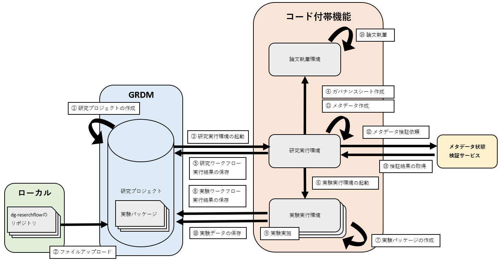

## 基本編の本編

基本編の本編では以下のフローに沿ってリサーチフローを利用した研究の進め方を学習します。

1. [研究用プロジェクトを作成する](./get_started/create_project.md)（下図の①）
1. [データ管理計画を作成する](./get_started/create_dmp.md)(下図の②～④)
1. [研究実行環境を構築する](./get_started/create_research_env.md)（下図の⑤）
1. [テスト実験を行う](./get_started/carry_out_test_experiment.md)（下図の⑥～⑩）
    * 実験実行環境の利用における「Hello world」です。
    * 実験の再開手順も確認します。
1. [本実験を行う](./get_started/carry_out_main_experiment.md)
    * [本章が扱う研究テーマ](./top.md#本章が扱う研究テーマ)に沿って X 銭広角散乱信号の模擬データを生成します。
1. [実験結果の解析を行う](./get_started/carry_out_analysis.md)
    * 本実験で生成された模擬データを解析します。
    * このステップでは画像中心の決定を行います。
1. [実験結果と解析結果から更なる解析を行う](./get_started/carry_out_further_analyses.md)
    * 本実験の結果と最初の解析結果（画像中心に関するデータ）を利用して更なる解析を行います。
1. [メタデータの状態の検証を行う](./get_started/validate_metadata.md)（下図の⑪～⑬）
    * この検証は研究中いつでも可能です。
1. [論文を執筆する](./get_started/create_paper.md)（下図の⑭）
1. [研究を終了する](./get_started/finish_research.md)

上記フローをすべて完了したら次のいずれかに進みましょう。

* [（オプション）DG-Webを利用したメタデータ検証](./option_dgweb.md)
* [（オプション）Governed Run 機能を利用した計算実験の再現性の検証](./option_governed_run.md)
* [（オプション）DG-CORE の基本的な機能の使い方の学習開始](./how_to_use_dg_core.md)
* [基本編のまとめ](./summary.md)

## 移動用リンク

* [基本編](./top.md)
